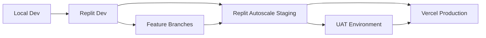
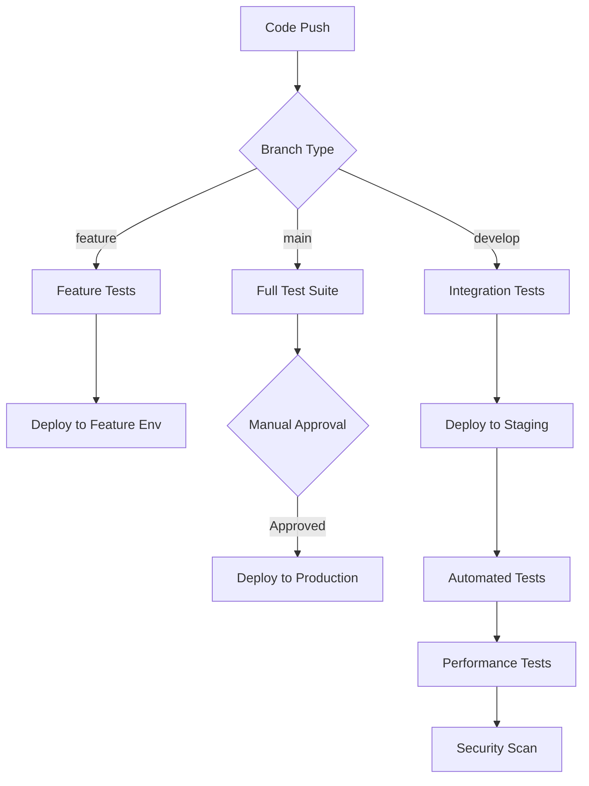
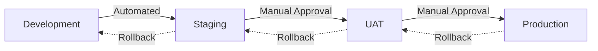

# Environment Pipeline Strategy - Rishi Platform

## Overview

This document outlines the comprehensive environment strategy and CI/CD pipeline for the Rishi Platform, detailing the flow from development through staging to production across Replit and Vercel platforms.

## Environment Architecture

### Environment Overview



### Environment Specifications

| Environment | Platform | Purpose | Database | URL |
|------------|----------|---------|----------|-----|
| Development | Replit | Active development | Neon Dev | dev.replit.app |
| Feature Branches | Replit | Feature testing | Neon Dev | feature-*.replit.app |
| Staging | Replit Autoscale | Integration testing | Neon Staging | staging.rishiplatform.com |
| UAT | Vercel Preview | User acceptance | Neon Staging | uat.rishiplatform.com |
| Production | Vercel | Live system | Neon Production | app.rishiplatform.com |

## Development Environment (Replit)

### Configuration
```javascript
// .env.development
NODE_ENV=development
DATABASE_URL=postgresql://dev_db_connection
NEXT_PUBLIC_API_URL=https://dev.replit.app
ENABLE_HOT_RELOAD=true
ENABLE_DEBUG_TOOLS=true
LOG_LEVEL=debug
```

### Development Features
- Hot module replacement
- Debug tools enabled
- Mock data available
- Relaxed security for testing
- Direct database access
- Real-time log streaming

### Development Workflow
1. **Branch Creation**
   ```bash
   git checkout -b feature/new-feature
   ```

2. **Replit Development**
   - Automatic environment provisioning
   - Live collaboration features
   - Integrated testing tools
   - Database branching

3. **Code Quality Checks**
   ```bash
   npm run lint
   npm run type-check
   npm run test
   ```

## Staging Environment (Replit Autoscale)

### Configuration
```javascript
// .env.staging
NODE_ENV=staging
DATABASE_URL=postgresql://staging_db_connection
NEXT_PUBLIC_API_URL=https://staging.rishiplatform.com
ENABLE_AUTOSCALE=true
MIN_INSTANCES=2
MAX_INSTANCES=10
ENABLE_MONITORING=true
```

### Staging Features
- Auto-scaling capabilities
- Production-like configuration
- Full monitoring suite
- Load testing environment
- Integration testing
- Performance profiling

### Staging Deployment Process
```yaml
# .github/workflows/staging-deploy.yml
name: Deploy to Staging
on:
  push:
    branches: [develop]

jobs:
  deploy:
    runs-on: ubuntu-latest
    steps:
      - uses: actions/checkout@v3
      - name: Run Tests
        run: |
          npm ci
          npm run test
          npm run test:integration
      
      - name: Deploy to Replit Autoscale
        uses: replit/autoscale-deploy@v1
        with:
          replit-token: ${{ secrets.REPLIT_TOKEN }}
          environment: staging
```

## Production Environment (Vercel)

### Configuration
```javascript
// .env.production
NODE_ENV=production
DATABASE_URL=${{ secrets.PROD_DATABASE_URL }}
NEXT_PUBLIC_API_URL=https://app.rishiplatform.com
ENABLE_ANALYTICS=true
ENABLE_ERROR_TRACKING=true
LOG_LEVEL=error
```

### Production Features
- Global CDN distribution
- Automatic SSL/TLS
- DDoS protection
- Zero-downtime deployments
- Automatic scaling
- Edge functions

### Production Deployment Process
```yaml
# .github/workflows/production-deploy.yml
name: Deploy to Production
on:
  push:
    branches: [main]

jobs:
  deploy:
    runs-on: ubuntu-latest
    steps:
      - uses: actions/checkout@v3
      
      - name: Run Full Test Suite
        run: |
          npm ci
          npm run test
          npm run test:integration
          npm run test:e2e
      
      - name: Security Scan
        uses: aquasecurity/trivy-action@master
      
      - name: Deploy to Vercel
        uses: vercel/action@v20
        with:
          vercel-token: ${{ secrets.VERCEL_TOKEN }}
          vercel-org-id: ${{ secrets.VERCEL_ORG_ID }}
          vercel-project-id: ${{ secrets.VERCEL_PROJECT_ID }}
          production: true
```

## CI/CD Pipeline

### Pipeline Overview



### Continuous Integration

#### Code Quality Gates
```javascript
// .github/workflows/ci.yml
name: Continuous Integration
on: [push, pull_request]

jobs:
  quality:
    runs-on: ubuntu-latest
    steps:
      - name: Lint Code
        run: npm run lint
        
      - name: Type Check
        run: npm run type-check
        
      - name: Unit Tests
        run: npm run test -- --coverage
        
      - name: Code Coverage
        uses: codecov/codecov-action@v3
        with:
          fail_ci_if_error: true
          minimum_coverage: 80
```

#### Security Scanning
```yaml
security:
  runs-on: ubuntu-latest
  steps:
    - name: Dependency Scan
      run: npm audit --audit-level=moderate
      
    - name: SAST Scan
      uses: github/super-linter@v4
      
    - name: Secret Scanning
      uses: trufflesecurity/trufflehog@main
```

### Continuous Deployment

#### Deployment Strategies

**Feature Branches**
- Automatic deployment on push
- Temporary environments
- Automatic cleanup after merge
- Shareable preview URLs

**Staging Deployment**
- Automatic on develop merge
- Full test suite execution
- Performance benchmarking
- Rollback capability

**Production Deployment**
- Manual approval required
- Blue-green deployment
- Canary releases (10% → 50% → 100%)
- Instant rollback capability

### Environment Promotion



## Database Management

### Database Strategy

#### Development Database
```sql
-- Automatic schema sync
-- Test data seeding
-- Regular reset capability
-- Branch-specific databases
```

#### Staging Database
```sql
-- Production data subset
-- Anonymized PII
-- Performance testing data
-- Migration testing
```

#### Production Database
```sql
-- Full backup every 6 hours
-- Point-in-time recovery
-- Read replicas for analytics
-- Connection pooling
```

### Migration Strategy
```bash
# Database migration flow
npm run db:migrate:create   # Create migration
npm run db:migrate:test     # Test in dev
npm run db:migrate:staging  # Apply to staging
npm run db:migrate:prod     # Apply to production
```

## Environment Variables Management

### Variable Categories

#### Public Variables
```javascript
NEXT_PUBLIC_APP_NAME=Rishi Platform
NEXT_PUBLIC_API_VERSION=v1
NEXT_PUBLIC_GOOGLE_MAPS_KEY=${{ environment specific }}
```

#### Private Variables
```javascript
DATABASE_URL=${{ encrypted }}
JWT_SECRET=${{ encrypted }}
ENCRYPTION_KEY=${{ encrypted }}
```

### Secret Management
- Development: `.env.local` files
- Staging: Replit Secrets
- Production: Vercel Environment Variables
- Rotation: Quarterly for all secrets

## Monitoring & Observability

### Monitoring Stack

#### Development
- Console logging
- React Developer Tools
- Network inspection
- Database query logging

#### Staging
- Application Performance Monitoring
- Error tracking (Sentry)
- Custom metrics
- Load testing results

#### Production
- Real User Monitoring (RUM)
- Synthetic monitoring
- Business metrics
- SLA tracking

### Alerting Strategy

```yaml
alerts:
  - name: API Response Time
    condition: p95 > 500ms
    severity: warning
    
  - name: Error Rate
    condition: rate > 1%
    severity: critical
    
  - name: Database Connections
    condition: active > 80%
    severity: warning
```

## Rollback Procedures

### Automatic Rollback Triggers
- Error rate >5%
- Response time >1000ms (p95)
- Health check failures
- Memory usage >90%

### Manual Rollback Process
1. Identify issue in monitoring
2. Initiate rollback via dashboard
3. Verify previous version active
4. Investigate root cause
5. Fix and redeploy

## Environment Sync Procedures

### Configuration Sync
```bash
# Sync staging config to production
npm run config:sync --from=staging --to=production --dry-run
npm run config:sync --from=staging --to=production --confirm
```

### Database Sync
```bash
# Sync production to staging (anonymized)
npm run db:sync --from=production --to=staging --anonymize
```

### Feature Flag Sync
```javascript
// Feature flags managed centrally
const features = {
  newBookingFlow: {
    dev: true,
    staging: true,
    production: false
  }
};
```

## Disaster Recovery

### Backup Strategy
- **Code**: Git repositories (GitHub)
- **Database**: Automated backups every 6 hours
- **Configurations**: Version controlled
- **Secrets**: Encrypted backup vault

### Recovery Procedures
1. **Service Failure**
   - Automatic failover to secondary region
   - Maximum 5-minute downtime

2. **Data Loss**
   - Point-in-time recovery available
   - Maximum 6-hour data loss

3. **Complete Disaster**
   - Full recovery from backups
   - 4-hour Recovery Time Objective (RTO)

## Performance Benchmarks

### Environment SLAs

| Metric | Development | Staging | Production |
|--------|------------|---------|------------|
| Uptime | 95% | 99% | 99.9% |
| Response Time | <500ms | <300ms | <200ms |
| Error Rate | <5% | <1% | <0.1% |
| Deploy Time | <2min | <5min | <10min |

## Best Practices

### Development Best Practices
1. Always work in feature branches
2. Run tests before pushing
3. Use meaningful commit messages
4. Keep dependencies updated
5. Document environment changes

### Deployment Best Practices
1. Never skip staging
2. Always run full test suite
3. Monitor after deployment
4. Have rollback plan ready
5. Communicate deployments

### Security Best Practices
1. Rotate secrets regularly
2. Use least privilege access
3. Audit environment access
4. Encrypt sensitive data
5. Monitor for vulnerabilities

## Conclusion

This environment pipeline strategy ensures smooth, reliable deployments from development through to production. The combination of Replit for development and staging with Vercel for production provides an optimal balance of developer experience, cost efficiency, and production reliability. Regular reviews and updates of this strategy ensure it continues to meet the evolving needs of the Rishi Platform.