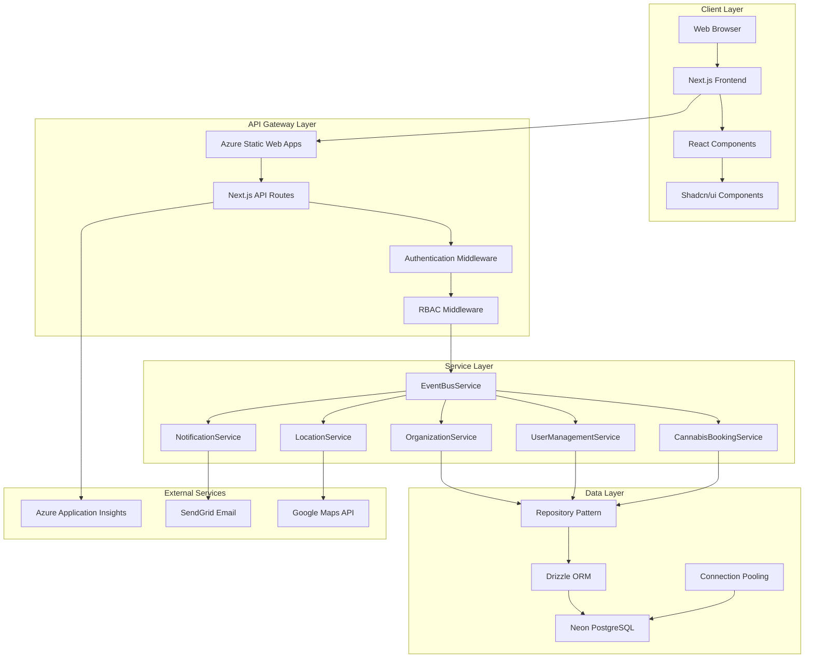
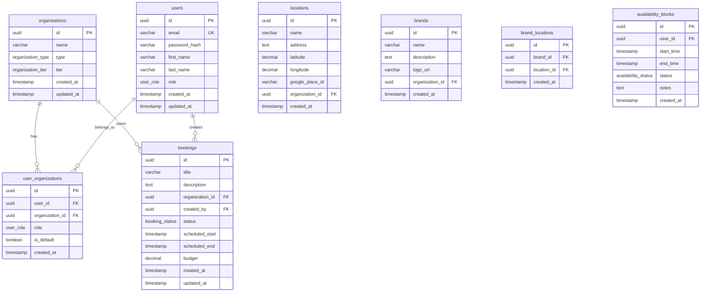
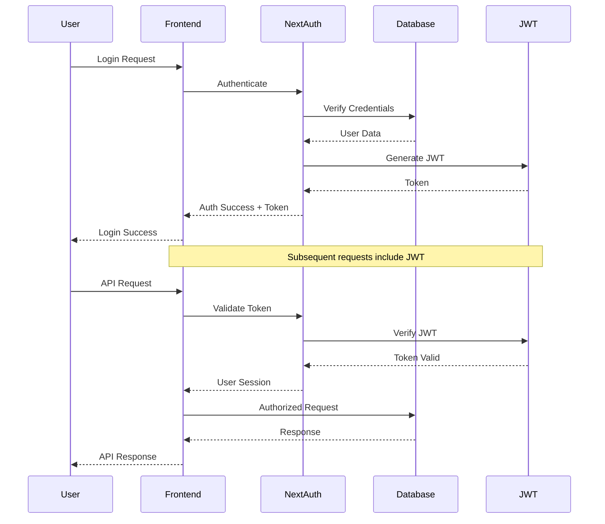

# Rishi Platform - Complete Application Architecture

_Comprehensive Technical Documentation_
_Last Updated: June 23, 2025_

## 🏛️ Architecture Overview

The Rishi Platform is a sophisticated workforce management application built on modern web technologies with a microservices architecture, designed for scalability, maintainability, and high performance in cannabis legal states.

## 🎯 System Design Principles

### **Core Architectural Pillars**

1. **Microservices Architecture**: Service-oriented design with clear boundaries
2. **Event-Driven Design**: Asynchronous communication via EventBusService
3. **UUID-Based Entities**: Consistent entity tracking across all microservices
4. **RBAC Security Model**: Role-based access control throughout the application
5. **Multi-Organization Support**: Tenant isolation with context switching

## 🔧 Technology Stack

### **Frontend Technologies**

```typescript
Framework: Next.js 15.3.2 (App Router)
Language: TypeScript 5.x (strict mode)
UI Library: Shadcn/ui + Radix UI primitives
Styling: Tailwind CSS with custom theming
State Management: React Context + React Query
Forms: React Hook Form + Zod validation
Icons: Lucide React + React Icons
Charts: Recharts for data visualization
Maps: Google Maps JavaScript API
```

### **Backend Technologies**

```typescript
Runtime: Node.js 18.x LTS
Framework: Next.js API Routes (serverless)
Database: PostgreSQL (Neon serverless)
ORM: Drizzle ORM with TypeScript
Authentication: NextAuth.js + JWT
Validation: Zod schemas
Testing: Jest + Testing Library
Documentation: TypeDoc + JSDoc
```

### **Infrastructure & DevOps**

```yaml
Hosting: Azure Static Web Apps
Functions: Azure Functions (Node.js 18)
Database: Neon PostgreSQL (serverless)
CDN: Azure CDN (global distribution)
SSL: Azure-managed certificates
Monitoring: Application Insights
CI/CD: GitHub Actions
```

## 🏗️ System Architecture Diagram



## 📊 Database Architecture

### **Entity Relationship Diagram**



### **Database Schema Implementation**

```typescript
// shared/schema.ts - Complete schema definitions
import {
  pgTable,
  uuid,
  varchar,
  text,
  timestamp,
  boolean,
  integer,
  decimal,
  pgEnum,
} from "drizzle-orm/pg-core";
import { createInsertSchema } from "drizzle-zod";
import { z } from "zod";

// Enums
export const userRoleEnum = pgEnum("user_role", [
  "super_admin",
  "internal_admin",
  "internal_field_manager",
  "brand_agent",
  "client_manager",
  "client_user",
]);

export const organizationTypeEnum = pgEnum("organization_type", [
  "internal",
  "client",
  "partner",
]);

export const organizationTierEnum = pgEnum("organization_tier", [
  "internal",
  "tier1",
  "tier2",
  "tier3",
]);

export const bookingStatusEnum = pgEnum("booking_status", [
  "draft",
  "pending_approval",
  "approved",
  "in_progress",
  "completed",
  "cancelled",
  "on_hold",
]);

// Core Tables
export const organizations = pgTable("organizations", {
  id: uuid("id").defaultRandom().primaryKey(),
  name: varchar("name", { length: 100 }).notNull(),
  type: organizationTypeEnum("type").notNull().default("client"),
  tier: organizationTierEnum("tier"),
  settings: text("settings"), // JSON string for flexible settings
  createdAt: timestamp("created_at").defaultNow().notNull(),
  updatedAt: timestamp("updated_at").defaultNow().notNull(),
});

export const users = pgTable("users", {
  id: uuid("id").defaultRandom().primaryKey(),
  email: varchar("email", { length: 255 }).notNull().unique(),
  passwordHash: varchar("password_hash", { length: 255 }).notNull(),
  firstName: varchar("first_name", { length: 100 }).notNull(),
  lastName: varchar("last_name", { length: 100 }).notNull(),
  role: userRoleEnum("role").notNull().default("client_user"),
  isActive: boolean("is_active").notNull().default(true),
  lastLoginAt: timestamp("last_login_at"),
  createdAt: timestamp("created_at").defaultNow().notNull(),
  updatedAt: timestamp("updated_at").defaultNow().notNull(),
});

export const bookings = pgTable("bookings", {
  id: uuid("id").defaultRandom().primaryKey(),
  title: varchar("title", { length: 200 }).notNull(),
  description: text("description"),
  organizationId: uuid("organization_id")
    .notNull()
    .references(() => organizations.id),
  createdBy: uuid("created_by")
    .notNull()
    .references(() => users.id),
  status: bookingStatusEnum("status").notNull().default("draft"),
  scheduledStart: timestamp("scheduled_start").notNull(),
  scheduledEnd: timestamp("scheduled_end").notNull(),
  budget: decimal("budget", { precision: 12, scale: 2 }),
  actualCost: decimal("actual_cost", { precision: 12, scale: 2 }),
  locationId: uuid("location_id").references(() => locations.id),
  requirements: text("requirements"), // JSON string for booking requirements
  createdAt: timestamp("created_at").defaultNow().notNull(),
  updatedAt: timestamp("updated_at").defaultNow().notNull(),
});

// Zod Schemas for Validation
export const insertOrganizationSchema = createInsertSchema(organizations).omit({
  id: true,
  createdAt: true,
  updatedAt: true,
});

export const insertUserSchema = createInsertSchema(users).omit({
  id: true,
  createdAt: true,
  updatedAt: true,
  lastLoginAt: true,
});

export const insertBookingSchema = createInsertSchema(bookings).omit({
  id: true,
  createdAt: true,
  updatedAt: true,
});

// TypeScript Types
export type Organization = typeof organizations.$inferSelect;
export type User = typeof users.$inferSelect;
export type Booking = typeof bookings.$inferSelect;
export type InsertOrganization = z.infer<typeof insertOrganizationSchema>;
export type InsertUser = z.infer<typeof insertUserSchema>;
export type InsertBooking = z.infer<typeof insertBookingSchema>;
```

## 🎯 Microservices Architecture

### **1. EventBusService (Core Infrastructure)**

```typescript
// server/services/EventBusService.ts
export interface BusinessEvent {
  id: string;
  type: string;
  source: string;
  data: any;
  timestamp: Date;
  correlationId?: string;
  userId?: string;
  organizationId?: string;
}

export class EventBusService {
  private static instance: EventBusService;
  private eventHandlers: Map<string, EventHandler[]> = new Map();
  private eventLog: EventRecord[] = [];
  private circuitBreaker: CircuitBreakerService;

  public static getInstance(): EventBusService {
    if (!EventBusService.instance) {
      EventBusService.instance = new EventBusService();
    }
    return EventBusService.instance;
  }

  async publishEvent(event: BusinessEvent): Promise<void> {
    try {
      // Validate event structure
      this.validateEvent(event);

      // Log event for audit trail
      this.logEvent(event);

      // Get handlers for event type
      const handlers = this.eventHandlers.get(event.type) || [];

      // Execute handlers asynchronously with timeout
      await Promise.allSettled(
        handlers.map((handler) =>
          this.executeHandlerWithTimeout(handler, event, 5000),
        ),
      );

      console.log(`Event published: ${event.type}`, event);
    } catch (error) {
      console.error("Failed to publish event:", error);
      throw error;
    }
  }

  subscribe(eventType: string, handler: EventHandler): void {
    if (!this.eventHandlers.has(eventType)) {
      this.eventHandlers.set(eventType, []);
    }
    this.eventHandlers.get(eventType)!.push(handler);
  }

  // Health monitoring
  getHealthStatus(): ServiceHealth {
    return {
      status: "healthy",
      eventsProcessed: this.eventLog.length,
      activeHandlers: this.eventHandlers.size,
      lastActivity:
        this.eventLog[this.eventLog.length - 1]?.timestamp || new Date(),
      memoryUsage: process.memoryUsage(),
    };
  }
}
```

### **2. CannabisBookingService**

```typescript
// server/services/CannabisBookingService.ts
export class CannabisBookingService {
  constructor(
    private db: DrizzleDB,
    private eventBus: EventBusService,
    private locationService: LocationService,
    private userService: UserManagementService,
  ) {}

  async createBooking(data: InsertBooking): Promise<Booking> {
    try {
      // Validate booking data
      const validatedData = insertBookingSchema.parse(data);

      // Check for scheduling conflicts
      await this.validateSchedulingConflicts(validatedData);

      // Create booking in database transaction
      const booking = await this.db.transaction(async (tx) => {
        const [newBooking] = await tx
          .insert(bookings)
          .values(validatedData)
          .returning();

        // Publish booking created event
        await this.eventBus.publishEvent({
          id: uuid(),
          type: "BOOKING_CREATED",
          source: "CannabisBookingService",
          data: { booking: newBooking },
          timestamp: new Date(),
          userId: validatedData.createdBy,
          organizationId: validatedData.organizationId,
        });

        return newBooking;
      });

      return booking;
    } catch (error) {
      console.error("Failed to create booking:", error);
      throw error;
    }
  }

  async updateBookingStatus(
    bookingId: string,
    status: BookingStatus,
    userId: string,
  ): Promise<void> {
    try {
      const [updatedBooking] = await this.db
        .update(bookings)
        .set({
          status,
          updatedAt: new Date(),
        })
        .where(eq(bookings.id, bookingId))
        .returning();

      if (!updatedBooking) {
        throw new Error("Booking not found");
      }

      // Publish status change event
      await this.eventBus.publishEvent({
        id: uuid(),
        type: "BOOKING_STATUS_CHANGED",
        source: "CannabisBookingService",
        data: {
          bookingId,
          oldStatus: updatedBooking.status,
          newStatus: status,
          changedBy: userId,
        },
        timestamp: new Date(),
        userId,
        organizationId: updatedBooking.organizationId,
      });
    } catch (error) {
      console.error("Failed to update booking status:", error);
      throw error;
    }
  }

  async getBookingsByOrganization(
    organizationId: string,
    filters?: BookingFilters,
  ): Promise<Booking[]> {
    try {
      let query = this.db
        .select()
        .from(bookings)
        .where(eq(bookings.organizationId, organizationId));

      // Apply filters
      if (filters?.status) {
        query = query.where(eq(bookings.status, filters.status));
      }

      if (filters?.dateRange) {
        query = query.where(
          and(
            gte(bookings.scheduledStart, filters.dateRange.start),
            lte(bookings.scheduledEnd, filters.dateRange.end),
          ),
        );
      }

      return await query;
    } catch (error) {
      console.error("Failed to get bookings:", error);
      throw error;
    }
  }

  private async validateSchedulingConflicts(
    data: InsertBooking,
  ): Promise<void> {
    // Check for location conflicts
    if (data.locationId) {
      const conflicts = await this.db
        .select()
        .from(bookings)
        .where(
          and(
            eq(bookings.locationId, data.locationId),
            or(
              and(
                lte(bookings.scheduledStart, data.scheduledStart),
                gte(bookings.scheduledEnd, data.scheduledStart),
              ),
              and(
                lte(bookings.scheduledStart, data.scheduledEnd),
                gte(bookings.scheduledEnd, data.scheduledEnd),
              ),
            ),
            ne(bookings.status, "cancelled"),
          ),
        );

      if (conflicts.length > 0) {
        throw new Error("Scheduling conflict detected for this location");
      }
    }
  }
}
```

### **3. UserManagementService**

```typescript
// server/services/UserManagementService.ts
export class UserManagementService {
  constructor(
    private db: DrizzleDB,
    private eventBus: EventBusService,
  ) {}

  async createUser(userData: InsertUser): Promise<User> {
    try {
      // Validate user data
      const validatedData = insertUserSchema.parse(userData);

      // Hash password
      const passwordHash = await bcrypt.hash(validatedData.passwordHash, 12);

      // Create user in database
      const [user] = await this.db
        .insert(users)
        .values({
          ...validatedData,
          passwordHash,
        })
        .returning();

      // Publish user created event
      await this.eventBus.publishEvent({
        id: uuid(),
        type: "USER_CREATED",
        source: "UserManagementService",
        data: {
          userId: user.id,
          email: user.email,
          role: user.role,
        },
        timestamp: new Date(),
      });

      // Remove password hash from response
      const { passwordHash: _, ...userResponse } = user;
      return userResponse as User;
    } catch (error) {
      console.error("Failed to create user:", error);
      throw error;
    }
  }

  async authenticateUser(
    email: string,
    password: string,
  ): Promise<User | null> {
    try {
      const [user] = await this.db
        .select()
        .from(users)
        .where(and(eq(users.email, email), eq(users.isActive, true)));

      if (!user) {
        return null;
      }

      const isValidPassword = await bcrypt.compare(password, user.passwordHash);
      if (!isValidPassword) {
        return null;
      }

      // Update last login
      await this.db
        .update(users)
        .set({ lastLoginAt: new Date() })
        .where(eq(users.id, user.id));

      // Publish login event
      await this.eventBus.publishEvent({
        id: uuid(),
        type: "USER_LOGIN",
        source: "UserManagementService",
        data: { userId: user.id },
        timestamp: new Date(),
        userId: user.id,
      });

      const { passwordHash: _, ...userResponse } = user;
      return userResponse as User;
    } catch (error) {
      console.error("Failed to authenticate user:", error);
      throw error;
    }
  }

  async getUserPermissions(
    userId: string,
    organizationId?: string,
  ): Promise<Permission[]> {
    try {
      // Get user with organization relationships
      const userWithOrgs = await this.db
        .select({
          user: users,
          organization: organizations,
          role: userOrganizations.role,
        })
        .from(users)
        .leftJoin(userOrganizations, eq(users.id, userOrganizations.userId))
        .leftJoin(
          organizations,
          eq(userOrganizations.organizationId, organizations.id),
        )
        .where(eq(users.id, userId));

      if (!userWithOrgs.length) {
        throw new Error("User not found");
      }

      // Calculate permissions based on role and organization context
      return this.calculatePermissions(userWithOrgs, organizationId);
    } catch (error) {
      console.error("Failed to get user permissions:", error);
      throw error;
    }
  }

  private calculatePermissions(
    userWithOrgs: any[],
    organizationId?: string,
  ): Permission[] {
    // Complex permission calculation logic
    // Based on user role, organization tier, and context
    const permissions: Permission[] = [];

    // Implementation depends on specific RBAC requirements
    // This is a simplified version

    return permissions;
  }
}
```

## 🔐 Security Architecture

### **Authentication Flow**



### **RBAC Implementation**

```typescript
// middleware/auth.ts - Authentication & Authorization
export interface Permission {
  resource: string;
  action: string;
  conditions?: Record<string, any>;
}

export interface RolePermissions {
  [role: string]: Permission[];
}

export const ROLE_PERMISSIONS: RolePermissions = {
  super_admin: [
    { resource: "*", action: "*" }, // Full access
  ],
  internal_admin: [
    { resource: "organizations", action: "read|create|update" },
    { resource: "users", action: "read|create|update" },
    { resource: "bookings", action: "read|create|update|delete" },
    { resource: "reports", action: "read|create" },
  ],
  internal_field_manager: [
    { resource: "bookings", action: "read|update" },
    { resource: "staff", action: "read|assign" },
    { resource: "locations", action: "read" },
  ],
  brand_agent: [
    { resource: "bookings", action: "read", conditions: { assigned: true } },
    { resource: "availability", action: "read|update" },
    { resource: "tasks", action: "read|update" },
  ],
  client_manager: [
    {
      resource: "bookings",
      action: "read|create|update",
      conditions: { organization: "own" },
    },
    { resource: "team", action: "read|manage" },
    { resource: "reports", action: "read" },
  ],
  client_user: [
    {
      resource: "bookings",
      action: "read",
      conditions: { organization: "own" },
    },
    { resource: "profile", action: "read|update" },
  ],
};

export async function withAuth(
  handler: NextApiHandler,
  requiredPermissions: Permission[],
): Promise<NextApiHandler> {
  return async (req: NextApiRequest, res: NextApiResponse) => {
    try {
      // Extract and validate JWT token
      const token = extractToken(req);
      if (!token) {
        return res.status(401).json({ error: "Authentication required" });
      }

      // Verify token and get user session
      const session = await verifyToken(token);
      if (!session) {
        return res.status(401).json({ error: "Invalid or expired token" });
      }

      // Get user permissions
      const userPermissions = await getUserPermissions(
        session.userId,
        req.query.organizationId as string,
      );

      // Check if user has required permissions
      const hasPermission = requiredPermissions.every((required) =>
        userPermissions.some((userPerm) =>
          matchesPermission(userPerm, required),
        ),
      );

      if (!hasPermission) {
        return res.status(403).json({ error: "Insufficient permissions" });
      }

      // Add user context to request
      (req as any).user = session;
      (req as any).permissions = userPermissions;

      return handler(req, res);
    } catch (error) {
      console.error("Authentication error:", error);
      return res.status(500).json({ error: "Authentication failed" });
    }
  };
}
```

## 📱 Frontend Architecture

### **Component Structure**

```typescript
// Component hierarchy and organization
src/
├── app/                          # Next.js App Router
│   ├── layout.tsx               # Root layout with providers
│   ├── page.tsx                 # Home page
│   ├── dashboard/               # Role-based dashboards
│   │   ├── page.tsx            # Dashboard home
│   │   ├── super-admin/        # Super admin specific pages
│   │   ├── field-manager/      # Field manager pages
│   │   └── client-user/        # Client user pages
│   ├── bookings/               # Booking management
│   │   ├── page.tsx            # Booking list
│   │   ├── create/             # Create booking
│   │   └── [id]/               # Booking details
│   └── api/                    # API routes (143 endpoints)
│
├── components/                  # Reusable components
│   ├── ui/                     # Shadcn/ui components
│   │   ├── button.tsx
│   │   ├── form.tsx
│   │   ├── dialog.tsx
│   │   └── ...
│   ├── layout/                 # Layout components
│   │   ├── SidebarLayout.tsx
│   │   ├── Header.tsx
│   │   └── Navigation.tsx
│   ├── bookings/              # Booking-specific components
│   │   ├── BookingForm.tsx
│   │   ├── BookingList.tsx
│   │   └── BookingCard.tsx
│   └── common/                # Common components
│       ├── LoadingSpinner.tsx
│       ├── ErrorBoundary.tsx
│       └── NotificationToast.tsx
│
├── contexts/                   # React contexts
│   ├── AuthContext.tsx
│   ├── OrganizationContext.tsx
│   └── ThemeContext.tsx
│
├── hooks/                      # Custom hooks
│   ├── useAuth.ts
│   ├── useOrganization.ts
│   ├── useBookings.ts
│   └── usePermissions.ts
│
├── lib/                        # Utility libraries
│   ├── api.ts                 # API client
│   ├── auth.ts                # Authentication utilities
│   ├── db.ts                  # Database connection
│   └── utils.ts               # General utilities
│
└── shared/                     # Shared modules
    ├── schema.ts              # Database schema
    ├── types.ts               # TypeScript types
    └── constants.ts           # Application constants
```

### **State Management Pattern**

```typescript
// contexts/OrganizationContext.tsx
interface OrganizationContextType {
  currentOrganization: Organization | null;
  organizations: Organization[];
  switchOrganization: (organizationId: string) => Promise<void>;
  loading: boolean;
  error: string | null;
}

export const OrganizationProvider: React.FC<{ children: React.ReactNode }> = ({
  children
}) => {
  const [currentOrganization, setCurrentOrganization] = useState<Organization | null>(null);
  const [organizations, setOrganizations] = useState<Organization[]>([]);
  const [loading, setLoading] = useState(true);
  const [error, setError] = useState<string | null>(null);

  const switchOrganization = useCallback(async (organizationId: string) => {
    try {
      setLoading(true);

      // Call API to switch organization context
      const response = await fetch('/api/auth/switch-organization', {
        method: 'POST',
        headers: { 'Content-Type': 'application/json' },
        body: JSON.stringify({ organizationId })
      });

      if (!response.ok) {
        throw new Error('Failed to switch organization');
      }

      const organization = organizations.find(org => org.id === organizationId);
      if (organization) {
        setCurrentOrganization(organization);

        // Update user preferences
        localStorage.setItem('currentOrganizationId', organizationId);

        // Trigger page refresh to update permissions
        window.location.reload();
      }
    } catch (err) {
      setError(err instanceof Error ? err.message : 'Unknown error');
    } finally {
      setLoading(false);
    }
  }, [organizations]);

  const fetchOrganizations = useCallback(async () => {
    try {
      const response = await fetch('/api/organizations/user');
      if (!response.ok) {
        throw new Error('Failed to fetch organizations');
      }

      const data = await response.json();
      setOrganizations(data.organizations);

      // Set default organization
      const defaultOrg = data.organizations.find((org: Organization) => org.isDefault)
        || data.organizations[0];
      if (defaultOrg) {
        setCurrentOrganization(defaultOrg);
      }
    } catch (err) {
      setError(err instanceof Error ? err.message : 'Failed to load organizations');
    } finally {
      setLoading(false);
    }
  }, []);

  useEffect(() => {
    fetchOrganizations();
  }, [fetchOrganizations]);

  return (
    <OrganizationContext.Provider value={{
      currentOrganization,
      organizations,
      switchOrganization,
      loading,
      error
    }}>
      {children}
    </OrganizationContext.Provider>
  );
};
```

## 🚀 Performance Optimization

### **Build Optimization**

```typescript
// next.config.mjs - Performance optimizations
const nextConfig = {
  // Bundle optimization for Azure 244KB limits
  webpack: (config, { isServer, dev }) => {
    if (!dev && isServer) {
      config.optimization.splitChunks = {
        chunks: "all",
        minSize: 20000,
        maxSize: 200000,
        cacheGroups: {
          vendor: {
            test: /[\\/]node_modules[\\/]/,
            name: "vendors",
            chunks: "all",
            maxSize: 200000,
          },
        },
      };
    }
    return config;
  },

  // Experimental features for performance
  experimental: {
    optimizeCss: true,
    serverComponentsExternalPackages: [
      "@neondatabase/serverless",
      "drizzle-orm",
    ],
  },

  // Image optimization (disabled for static export)
  images: {
    unoptimized: true,
  },
};
```

### **Database Optimization**

```typescript
// lib/db-connection.ts - Connection pooling
import { Pool } from "pg";
import { drizzle } from "drizzle-orm/node-postgres";

class DatabaseConnectionManager {
  private static instance: DatabaseConnectionManager;
  private pool: Pool | null = null;
  private db: any = null;

  public static getInstance(): DatabaseConnectionManager {
    if (!DatabaseConnectionManager.instance) {
      DatabaseConnectionManager.instance = new DatabaseConnectionManager();
    }
    return DatabaseConnectionManager.instance;
  }

  public getDatabase() {
    if (!this.db) {
      this.initializeConnection();
    }
    return this.db;
  }

  private initializeConnection() {
    if (!process.env.DATABASE_URL) {
      throw new Error("DATABASE_URL environment variable is not set");
    }

    // Create connection pool optimized for serverless
    this.pool = new Pool({
      connectionString: process.env.DATABASE_URL,
      max: 10, // Maximum connections
      idleTimeoutMillis: 30000, // 30 seconds
      connectionTimeoutMillis: 3000, // 3 seconds
      ssl:
        process.env.NODE_ENV === "production"
          ? { rejectUnauthorized: false }
          : undefined,
    });

    // Initialize Drizzle with connection pool
    this.db = drizzle(this.pool, {
      schema: allSchemas,
      logger: process.env.NODE_ENV === "development",
    });

    console.log("Database connection pool initialized:", {
      max: 10,
      timeout: "3000ms",
    });
  }

  // Graceful shutdown
  public async closeConnection(): Promise<void> {
    if (this.pool) {
      await this.pool.end();
      console.log("Database connection pool closed");
    }
  }
}

export const db = DatabaseConnectionManager.getInstance().getDatabase();
```

## 📊 Monitoring & Observability

### **Health Check Implementation**

```typescript
// app/api/health/route.ts - Comprehensive health monitoring
export async function GET(request: Request) {
  const healthChecks = {
    database: await checkDatabaseHealth(),
    services: await checkServicesHealth(),
    external: await checkExternalServices(),
    system: getSystemMetrics(),
  };

  const overallStatus = Object.values(healthChecks).every(
    (check) => check.status === "healthy",
  )
    ? "healthy"
    : "unhealthy";

  return Response.json(
    {
      status: overallStatus,
      timestamp: new Date().toISOString(),
      version: process.env.npm_package_version,
      checks: healthChecks,
    },
    {
      status: overallStatus === "healthy" ? 200 : 503,
    },
  );
}

async function checkDatabaseHealth(): Promise<HealthCheck> {
  try {
    const start = Date.now();
    await db.select().from(organizations).limit(1);
    const responseTime = Date.now() - start;

    return {
      status: "healthy",
      responseTime: `${responseTime}ms`,
      details: "Database connection successful",
    };
  } catch (error) {
    return {
      status: "unhealthy",
      error:
        error instanceof Error ? error.message : "Database connection failed",
    };
  }
}

async function checkServicesHealth(): Promise<HealthCheck> {
  try {
    const eventBusHealth = EventBusService.getInstance().getHealthStatus();

    return {
      status: "healthy",
      details: {
        eventBus: eventBusHealth,
        memoryUsage: process.memoryUsage(),
        uptime: process.uptime(),
      },
    };
  } catch (error) {
    return {
      status: "unhealthy",
      error:
        error instanceof Error ? error.message : "Service health check failed",
    };
  }
}
```

---

**Document Status**: ✅ COMPREHENSIVE ARCHITECTURE DOCUMENTATION
**Coverage**: Complete system architecture with implementation details
**Maintainability**: High - Well-documented patterns and practices
**Scalability**: Designed for growth with microservices architecture
