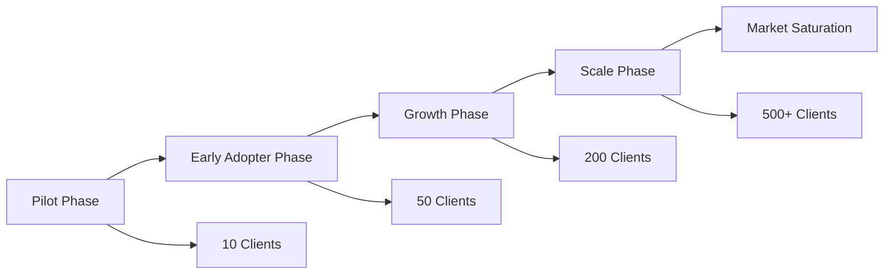
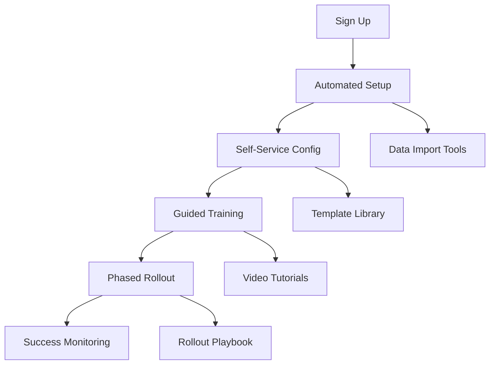

# Client Rollout Plan - Rishi Platform

## Executive Summary

This comprehensive plan outlines the phased approach for rolling out the Rishi Platform to cannabis industry clients, ensuring successful adoption, minimal disruption, and maximum value delivery. The rollout strategy progresses from pilot clients through to full market deployment.

## Rollout Strategy Overview

### Phased Approach



### Timeline Overview
- **Pilot Phase**: Months 1-2 (10 strategic clients)
- **Early Adopter Phase**: Months 3-4 (50 clients)
- **Growth Phase**: Months 5-8 (200 clients)
- **Scale Phase**: Months 9-12 (500+ clients)
- **Market Saturation**: Year 2+ (Industry standard)

## Phase 1: Pilot Program (Months 1-2)

### Pilot Client Selection Criteria

#### Ideal Pilot Client Profile
1. **Size**: 50-200 employees (manageable complexity)
2. **Tech Readiness**: Comfortable with technology adoption
3. **Location**: Operating in 1-3 states (moderate complexity)
4. **Engagement**: Willing to provide detailed feedback
5. **Industry Position**: Respected in cannabis community

#### Target Pilot Clients
```markdown
Tier 1 - Dispensary Chains (3 clients)
- Multi-location operations
- Strong training culture
- Growth-oriented

Tier 2 - Cannabis Brands (4 clients)
- Event-heavy operations
- Brand ambassador programs
- Marketing focus

Tier 3 - Cultivation/Manufacturing (3 clients)
- Shift-based operations
- Compliance-focused
- Safety-oriented
```

### Pilot Program Structure

#### Week 1-2: Client Onboarding
```yaml
Day 1-2: Kickoff & Discovery
  - Executive alignment meeting
  - Current state assessment
  - Success criteria definition
  - Timeline establishment

Day 3-5: Platform Setup
  - Account provisioning
  - Data migration planning
  - Integration assessment
  - Custom configuration

Day 6-10: Training & Testing
  - Admin training (8 hours)
  - Manager training (4 hours)
  - End-user training (2 hours)
  - Pilot team selection
```

#### Week 3-4: Controlled Deployment
```yaml
Week 3: Limited Rollout
  - 20% of workforce
  - Core features only
  - Daily check-ins
  - Issue tracking

Week 4: Expanded Rollout
  - 50% of workforce
  - Additional features
  - Performance monitoring
  - Feedback collection
```

#### Week 5-8: Full Deployment & Optimization
```yaml
Week 5-6: Complete Rollout
  - 100% workforce adoption
  - All features enabled
  - Support optimization
  - Success measurement

Week 7-8: Optimization
  - Process refinement
  - Feature requests
  - Case study development
  - Reference availability
```

### Pilot Success Metrics

#### Quantitative Metrics
- User adoption rate: >90%
- Daily active users: >80%
- Task completion rate: >95%
- System uptime: 99.9%
- Support ticket volume: <5 per week

#### Qualitative Metrics
- User satisfaction: >4.5/5
- Admin satisfaction: >4.7/5
- Feature completeness: >90%
- Process improvement: Documented
- ROI demonstration: Clear

### Pilot Support Structure

#### Dedicated Support Team
```javascript
const pilotSupportTeam = {
  customerSuccessManager: {
    role: "Primary contact",
    availability: "Business hours",
    responsibilities: [
      "Weekly check-ins",
      "Success tracking",
      "Escalation management",
      "Strategic guidance"
    ]
  },
  technicalSpecialist: {
    role: "Technical support",
    availability: "On-call",
    responsibilities: [
      "Integration support",
      "Troubleshooting",
      "Performance optimization",
      "Training delivery"
    ]
  },
  productManager: {
    role: "Product feedback",
    availability: "Weekly sessions",
    responsibilities: [
      "Feature requests",
      "Roadmap alignment",
      "Use case documentation",
      "Product evolution"
    ]
  }
};
```

## Phase 2: Early Adopter Program (Months 3-4)

### Scaling Strategy

#### Client Acquisition Approach
1. **Referral Program**
   - Pilot client referrals
   - Industry introductions
   - Success story sharing
   - Incentive structure

2. **Targeted Outreach**
   - Cannabis trade shows
   - Industry associations
   - Webinar series
   - Content marketing

3. **Partnership Channel**
   - POS integrations
   - Compliance providers
   - Industry consultants
   - Trade organizations

### Early Adopter Onboarding

#### Streamlined Onboarding Process


#### Self-Service Resources
1. **Onboarding Portal**
   - Interactive setup wizard
   - Configuration templates
   - Best practices guide
   - Video library

2. **Training Academy**
   - Role-based curriculums
   - Certification programs
   - Live webinar series
   - On-demand content

3. **Community Forum**
   - Peer support
   - Best practices sharing
   - Feature requests
   - Success stories

### Early Adopter Benefits

#### Exclusive Advantages
- 50% discount for 6 months
- Priority feature requests
- Exclusive webinars
- Direct product team access
- Early access to new features
- Co-marketing opportunities

## Phase 3: Growth Phase (Months 5-8)

### Market Expansion Strategy

#### Geographic Expansion
```markdown
Month 5-6: West Coast Saturation
- California: 50 clients
- Oregon: 20 clients
- Washington: 20 clients
- Nevada: 10 clients

Month 7-8: National Expansion
- Colorado: 30 clients
- Arizona: 20 clients
- Illinois: 20 clients
- Michigan: 20 clients
- Massachusetts: 10 clients
```

#### Segment Expansion
1. **Enterprise Clients** (Multi-State Operators)
   - Custom implementation plans
   - Dedicated account teams
   - Enterprise features
   - SLA guarantees

2. **Small Business** (Single Location)
   - Simplified onboarding
   - Starter packages
   - Group training sessions
   - Community support

3. **Specialty Segments**
   - Delivery services
   - Cannabis events
   - Temporary staffing
   - Compliance services

### Scaled Onboarding Process

#### Automation & Efficiency
```typescript
// Automated onboarding workflow
export class AutomatedOnboarding {
  async initiateClient(client: Client) {
    // Automatic account creation
    const account = await this.createAccount(client);
    
    // AI-powered configuration
    const config = await this.generateConfig(client.profile);
    
    // Automated data import
    await this.importData(client.existingData);
    
    // Smart user provisioning
    await this.provisionUsers(client.employees);
    
    // Customized training plan
    const trainingPlan = await this.createTrainingPlan(client);
    
    // Success tracking setup
    await this.initializeMetrics(client);
    
    return {
      account,
      config,
      trainingPlan,
      goLiveDate: this.calculateGoLiveDate(client)
    };
  }
}
```

### Growth Support Model

#### Tiered Support Structure
```yaml
Tier 1 - Self-Service (70% of clients)
  - Knowledge base access
  - Community forum
  - Email support (24hr response)
  - Monthly webinars

Tier 2 - Standard Support (25% of clients)
  - All Tier 1 benefits
  - Phone support (business hours)
  - Dedicated success manager
  - Quarterly business reviews

Tier 3 - Premium Support (5% of clients)
  - All Tier 2 benefits
  - 24/7 phone support
  - Dedicated technical team
  - Monthly business reviews
  - Custom training programs
```

## Phase 4: Scale Phase (Months 9-12)

### Mass Market Approach

#### Channel Strategy
1. **Direct Sales**
   - Inside sales team
   - Automated demos
   - Free trials
   - Quick close process

2. **Partner Channel**
   - Reseller program
   - Integration partners
   - Referral partners
   - White-label options

3. **Digital Marketing**
   - SEO optimization
   - Content marketing
   - Social media
   - Paid advertising

### Standardized Packages

#### Service Tiers
```javascript
const serviceTiers = {
  starter: {
    name: "Cannabis Starter",
    price: "$299/month",
    features: [
      "Up to 25 staff",
      "Basic scheduling",
      "Mobile access",
      "Email support"
    ],
    onboarding: "Self-service"
  },
  professional: {
    name: "Cannabis Pro",
    price: "$799/month",
    features: [
      "Up to 100 staff",
      "Advanced scheduling",
      "Compliance tracking",
      "Phone support",
      "API access"
    ],
    onboarding: "Guided setup"
  },
  enterprise: {
    name: "Cannabis Enterprise",
    price: "Custom",
    features: [
      "Unlimited staff",
      "Custom features",
      "White-label option",
      "Dedicated support",
      "SLA guarantee"
    ],
    onboarding: "White-glove service"
  }
};
```

### Scale Operations

#### Operational Excellence
1. **Onboarding Factory**
   - 2-hour setup time
   - Automated provisioning
   - Template-based config
   - Batch training sessions

2. **Support Efficiency**
   - AI-powered chat
   - Automated ticket routing
   - Self-healing systems
   - Proactive monitoring

3. **Success at Scale**
   - Automated health scores
   - Predictive churn alerts
   - Scaled intervention
   - Community-driven support

## Client Success Framework

### Success Metrics Dashboard

```typescript
interface ClientHealthMetrics {
  adoption: {
    dailyActiveUsers: number;
    featureAdoption: Map<string, number>;
    userSatisfaction: number;
  };
  business: {
    efficiencyGains: number;
    costSavings: number;
    complianceScore: number;
    roiMultiple: number;
  };
  engagement: {
    supportTickets: number;
    trainingCompletion: number;
    featureRequests: number;
    referralsMade: number;
  };
}
```

### Intervention Triggers

#### Automated Alerts
- Daily active users <60%: Engagement intervention
- Support tickets >10/week: Technical intervention
- Feature adoption <50%: Training intervention
- Satisfaction <4.0: Executive intervention

### Success Playbooks

#### Playbook Examples
1. **Low Adoption Playbook**
   - Identify power users
   - Targeted re-training
   - Feature simplification
   - Success incentives

2. **Technical Issues Playbook**
   - Dedicated technical resource
   - Root cause analysis
   - Custom solutions
   - Performance optimization

3. **Growth Opportunity Playbook**
   - Expansion assessment
   - Additional feature training
   - Upsell presentation
   - Reference development

## Communication Strategy

### Client Communications

#### Regular Touchpoints
```yaml
Daily:
  - System status updates
  - Feature tips (in-app)

Weekly:
  - Success metrics email
  - Best practices blog

Monthly:
  - Product updates
  - Webinar invitations
  - Success stories

Quarterly:
  - Business reviews
  - Roadmap updates
  - Industry trends
```

### Marketing Support

#### Co-Marketing Opportunities
1. **Case Studies**
   - Success metrics
   - Implementation story
   - ROI demonstration
   - Video testimonials

2. **Joint Webinars**
   - Best practices sharing
   - Industry education
   - Product demonstrations
   - Q&A sessions

3. **Conference Presence**
   - Joint booth presence
   - Speaking opportunities
   - Customer panels
   - Award submissions

## Risk Mitigation

### Common Rollout Risks

#### Risk Matrix
| Risk | Probability | Impact | Mitigation |
|------|------------|--------|------------|
| Slow adoption | Medium | High | Gamification, incentives |
| Data migration issues | Low | High | Validation tools, support |
| Integration failures | Medium | Medium | Pre-built connectors |
| Change resistance | High | Medium | Change management program |
| Support overwhelm | Medium | High | Automation, self-service |

### Contingency Plans

#### Escalation Procedures
1. **Level 1**: Customer Success Manager
2. **Level 2**: Director of Customer Success
3. **Level 3**: VP of Operations
4. **Level 4**: Executive Team

## Success Metrics

### Rollout KPIs

#### Phase-Specific Targets
```javascript
const rolloutTargets = {
  pilot: {
    clients: 10,
    satisfaction: 4.7,
    adoption: 95,
    churn: 0
  },
  earlyAdopter: {
    clients: 50,
    satisfaction: 4.5,
    adoption: 90,
    churn: 5
  },
  growth: {
    clients: 200,
    satisfaction: 4.3,
    adoption: 85,
    churn: 10
  },
  scale: {
    clients: 500,
    satisfaction: 4.2,
    adoption: 80,
    churn: 15
  }
};
```

### Long-term Success Metrics
- Market share: 25% by Year 2
- Client retention: >90% annually
- Net Promoter Score: >50
- Revenue per client: $15,000/year
- Expansion revenue: 140% net retention

## Conclusion

This client rollout plan provides a systematic approach to bringing the Rishi Platform to market, ensuring successful adoption across the cannabis industry. Through careful phase management, comprehensive support, and continuous optimization, we will establish Rishi as the industry standard for cannabis workforce management while maintaining high client satisfaction and sustainable growth.