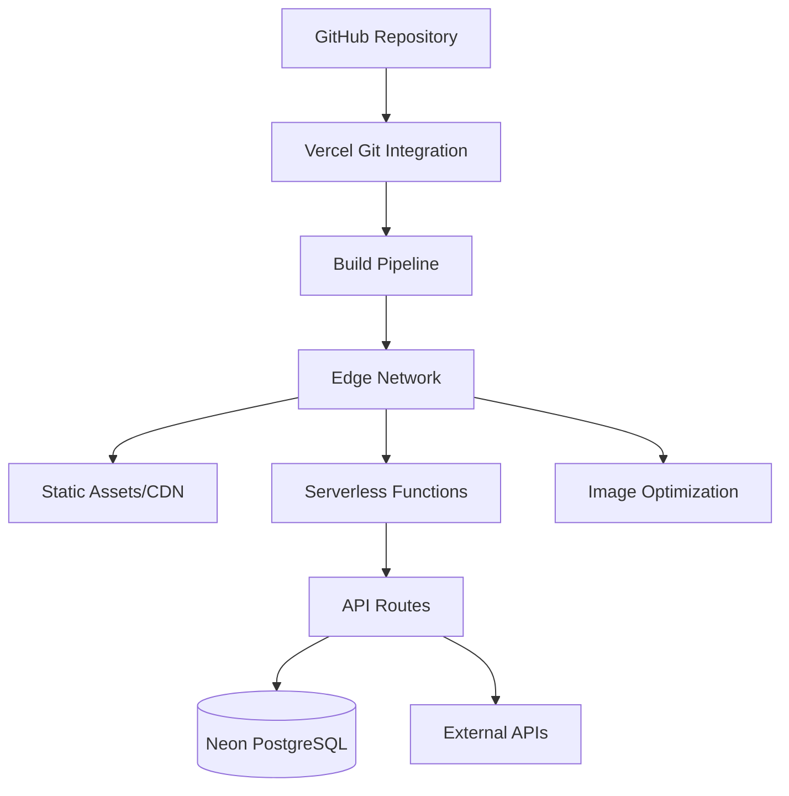
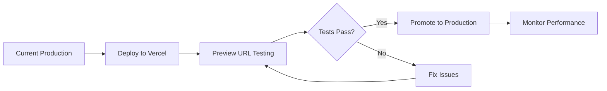

# Vercel Production Deployment Plan - Rishi Platform

## Executive Summary

This document outlines the comprehensive plan for deploying the Rishi Platform to Vercel as the production environment. Vercel provides optimal Next.js hosting with global CDN, automatic scaling, and seamless deployment workflows perfect for the Rishi Platform's architecture.

## Vercel Platform Benefits

### Why Vercel for Production
1. **Next.js Optimization**: Native Next.js support and optimization
2. **Global Performance**: Edge network with 100+ global locations
3. **Automatic Scaling**: Serverless functions scale to demand
4. **Zero Configuration**: Automatic optimization out of the box
5. **Developer Experience**: Git-based deployments and previews

### Key Features Utilized
- Edge Functions for API routes
- Image Optimization API
- Analytics and Web Vitals
- Preview Deployments
- Automatic HTTPS
- DDoS Protection

## Pre-Deployment Checklist

### Code Preparation
```yaml
Code Quality:
  - [ ] All TypeScript errors resolved
  - [ ] ESLint warnings addressed
  - [ ] Test coverage >80%
  - [ ] Security audit passed
  - [ ] Performance budget met

Configuration:
  - [ ] Environment variables documented
  - [ ] API endpoints configured
  - [ ] Database connections tested
  - [ ] Third-party integrations verified
  - [ ] Error tracking configured
```

### Infrastructure Readiness
```yaml
Database:
  - [ ] Neon PostgreSQL production instance
  - [ ] Connection pooling configured
  - [ ] Backup strategy implemented
  - [ ] Migration scripts ready
  - [ ] Data seeding prepared

External Services:
  - [ ] Google Maps API production key
  - [ ] Email service configured
  - [ ] SMS provider ready
  - [ ] Analytics configured
  - [ ] Monitoring setup
```

## Deployment Architecture

### Vercel Project Structure


### Environment Configuration

#### Production Environment Variables
```bash
# Database
DATABASE_URL="postgresql://[user]:[password]@[host]/[database]?sslmode=require"

# Authentication
NEXTAUTH_URL="https://app.rishiplatform.com"
NEXTAUTH_SECRET="[generated-secret]"
JWT_SECRET="[generated-jwt-secret]"

# API Keys
GOOGLE_MAPS_API_KEY="[production-key]"
SENDGRID_API_KEY="[production-key]"
TWILIO_API_KEY="[production-key]"

# Analytics
VERCEL_ANALYTICS_ID="[auto-generated]"
MIXPANEL_TOKEN="[production-token]"
SENTRY_DSN="[production-dsn]"

# Feature Flags
ENABLE_ANALYTICS="true"
ENABLE_ERROR_TRACKING="true"
ENABLE_PERFORMANCE_MONITORING="true"
```

#### Vercel Configuration
```json
// vercel.json
{
  "framework": "nextjs",
  "buildCommand": "npm run build",
  "outputDirectory": ".next",
  "devCommand": "npm run dev",
  "installCommand": "npm install",
  "regions": ["iad1"],
  "functions": {
    "app/api/*": {
      "maxDuration": 30
    }
  },
  "headers": [
    {
      "source": "/(.*)",
      "headers": [
        {
          "key": "X-Content-Type-Options",
          "value": "nosniff"
        },
        {
          "key": "X-Frame-Options",
          "value": "SAMEORIGIN"
        },
        {
          "key": "X-XSS-Protection",
          "value": "1; mode=block"
        }
      ]
    }
  ],
  "redirects": [
    {
      "source": "/api/health",
      "destination": "/api/health",
      "permanent": false
    }
  ]
}
```

## Deployment Process

### Phase 1: Initial Setup (Day 1)

#### 1.1 Vercel Project Creation
```bash
# Install Vercel CLI
npm i -g vercel

# Login to Vercel
vercel login

# Create project
vercel --prod

# Link to GitHub repository
vercel link

# Configure environment variables
vercel env add DATABASE_URL production
vercel env add NEXTAUTH_SECRET production
# ... add all production variables
```

#### 1.2 Domain Configuration
```yaml
Primary Domain:
  - app.rishiplatform.com
  
Additional Domains:
  - www.rishiplatform.com (redirect)
  - api.rishiplatform.com (API subdomain)
  
SSL Configuration:
  - Automatic HTTPS
  - HSTS enabled
  - TLS 1.3 minimum
```

### Phase 2: Database Migration (Day 2)

#### 2.1 Production Database Setup
```bash
# Create production database
neon database create rishi-production

# Run migrations
DATABASE_URL=$PROD_DATABASE_URL npm run db:push

# Seed initial data
npm run db:seed:production

# Verify database
npm run db:verify:production
```

#### 2.2 Data Migration Strategy
```typescript
// migration-strategy.ts
export const migrationPlan = {
  preDeployment: {
    backup: "Create full staging backup",
    validation: "Verify data integrity",
    testing: "Run migration dry run"
  },
  
  deployment: {
    maintenance: "Enable maintenance mode",
    migration: "Run production migration",
    verification: "Verify all data migrated",
    rollback: "Prepare rollback plan"
  },
  
  postDeployment: {
    monitoring: "Monitor for issues",
    validation: "User acceptance testing",
    optimization: "Performance tuning"
  }
};
```

### Phase 3: Deployment Execution (Day 3)

#### 3.1 Blue-Green Deployment


#### 3.2 Deployment Commands
```bash
# Deploy to preview
git push origin main

# Run production tests
npm run test:production

# Promote to production
vercel --prod

# Verify deployment
curl https://app.rishiplatform.com/api/health

# Check functions
vercel functions ls
```

### Phase 4: Post-Deployment (Day 4-5)

#### 4.1 Monitoring Setup
```typescript
// monitoring-config.ts
export const monitoringSetup = {
  vercelAnalytics: {
    enabled: true,
    webVitals: true,
    customEvents: true
  },
  
  sentry: {
    dsn: process.env.SENTRY_DSN,
    environment: 'production',
    tracesSampleRate: 0.1,
    profilesSampleRate: 0.1
  },
  
  customMetrics: {
    apiLatency: true,
    databasePerformance: true,
    userActivity: true,
    businessMetrics: true
  }
};
```

#### 4.2 Performance Optimization
```yaml
Optimization Checklist:
  - [ ] Enable ISR for static pages
  - [ ] Configure cache headers
  - [ ] Optimize images with next/image
  - [ ] Enable Vercel Edge Cache
  - [ ] Configure CDN rules
  - [ ] Monitor Core Web Vitals
```

## Performance Configuration

### Edge Function Optimization
```typescript
// api/middleware.ts
export const config = {
  runtime: 'edge',
  regions: ['iad1', 'sfo1'], // Primary regions
};

export async function middleware(request: Request) {
  // Add performance headers
  const response = NextResponse.next();
  
  response.headers.set('Cache-Control', 'public, max-age=60, stale-while-revalidate=300');
  response.headers.set('CDN-Cache-Control', 'max-age=3600');
  
  return response;
}
```

### Caching Strategy
```typescript
// Cache configuration
export const cacheConfig = {
  static: {
    images: 'max-age=31536000, immutable',
    fonts: 'max-age=31536000, immutable',
    css: 'max-age=31536000, immutable',
    js: 'max-age=31536000, immutable'
  },
  
  dynamic: {
    api: 'max-age=60, stale-while-revalidate=300',
    html: 'max-age=0, must-revalidate',
    json: 'max-age=300, stale-while-revalidate=600'
  }
};
```

## Security Configuration

### Security Headers
```typescript
// next.config.js security headers
const securityHeaders = [
  {
    key: 'Content-Security-Policy',
    value: ContentSecurityPolicy.replace(/\s{2,}/g, ' ').trim()
  },
  {
    key: 'Strict-Transport-Security',
    value: 'max-age=63072000; includeSubDomains; preload'
  },
  {
    key: 'X-Frame-Options',
    value: 'SAMEORIGIN'
  },
  {
    key: 'Permissions-Policy',
    value: 'camera=(), microphone=(), geolocation=(self)'
  },
  {
    key: 'Referrer-Policy',
    value: 'strict-origin-when-cross-origin'
  }
];
```

### API Security
```typescript
// API rate limiting
import { Ratelimit } from '@upstash/ratelimit';

const ratelimit = new Ratelimit({
  redis: Redis.fromEnv(),
  limiter: Ratelimit.slidingWindow(100, '1 m'),
  analytics: true
});

export async function rateLimitMiddleware(req: Request) {
  const ip = req.headers.get('x-forwarded-for') ?? 'anonymous';
  const { success, limit, reset, remaining } = await ratelimit.limit(ip);
  
  if (!success) {
    return new Response('Too Many Requests', {
      status: 429,
      headers: {
        'X-RateLimit-Limit': limit.toString(),
        'X-RateLimit-Remaining': remaining.toString(),
        'X-RateLimit-Reset': new Date(reset).toISOString()
      }
    });
  }
}
```

## Monitoring & Alerting

### Vercel Monitoring Dashboard
```yaml
Metrics Tracked:
  - Request Count
  - Error Rate
  - Response Time (p50, p95, p99)
  - Bandwidth Usage
  - Function Invocations
  - Build Times

Alerts Configured:
  - Error rate >1%
  - Response time p95 >500ms
  - Build failures
  - Function timeouts
  - Traffic spikes
```

### Custom Monitoring
```typescript
// Custom analytics tracking
export async function trackMetric(
  name: string,
  value: number,
  tags?: Record<string, string>
) {
  if (process.env.NODE_ENV === 'production') {
    await analytics.track({
      event: 'metric',
      properties: {
        metric_name: name,
        metric_value: value,
        ...tags
      }
    });
  }
}

// Usage example
await trackMetric('api.response_time', responseTime, {
  endpoint: '/api/bookings',
  method: 'GET',
  status: '200'
});
```

## Rollback Strategy

### Automatic Rollback Triggers
- Error rate >5%
- Response time >1000ms (p95)
- Memory usage >90%
- Function timeout rate >1%

### Manual Rollback Process
```bash
# List deployments
vercel ls

# Find previous stable deployment
vercel inspect [deployment-url]

# Rollback to previous version
vercel rollback [deployment-url]

# Verify rollback
curl https://app.rishiplatform.com/api/health
```

## Scaling Configuration

### Auto-Scaling Settings
```yaml
Serverless Functions:
  - Concurrent Executions: 1000 (default)
  - Memory: 1024MB per function
  - Timeout: 30 seconds (API routes)
  - Regions: Multi-region deployment

Static Assets:
  - Global CDN distribution
  - Automatic compression
  - Image optimization
  - Font subsetting
```

### Performance Targets
```yaml
Production SLAs:
  - Uptime: 99.9%
  - API Response: <200ms (p50)
  - Page Load: <2s (LCP)
  - Error Rate: <0.1%
  - Availability: Global
```

## Cost Management

### Vercel Pricing Optimization
```yaml
Cost Controls:
  - Function Invocation Limits
  - Bandwidth Monitoring
  - Build Time Optimization
  - Image Optimization Limits
  
Monthly Budget:
  - Base Plan: $20/user
  - Bandwidth: ~$500
  - Functions: ~$200
  - Analytics: $10/user
  - Total: ~$1000/month
```

## Disaster Recovery

### Backup Strategy
```yaml
Data Backups:
  - Database: Continuous (Neon)
  - Code: Git repository
  - Configurations: Version controlled
  - Secrets: Secure vault

Recovery Procedures:
  - RTO: 15 minutes
  - RPO: 5 minutes
  - Automated failover
  - Manual intervention plans
```

### Incident Response
```yaml
Incident Levels:
  P1 - Critical: Complete outage
  P2 - Major: Degraded performance
  P3 - Minor: Feature issues
  P4 - Low: Cosmetic issues

Response Times:
  P1: 15 minutes
  P2: 1 hour
  P3: 4 hours
  P4: Next business day
```

## Post-Deployment Checklist

### Immediate Verification (Hour 1)
- [ ] Health endpoints responding
- [ ] Authentication working
- [ ] Database connectivity verified
- [ ] API routes functional
- [ ] Static assets loading

### Day 1 Verification
- [ ] All features tested
- [ ] Performance metrics met
- [ ] No error spikes
- [ ] Monitoring active
- [ ] Alerts configured

### Week 1 Optimization
- [ ] Performance tuning
- [ ] Cache optimization
- [ ] Cost analysis
- [ ] User feedback collected
- [ ] Documentation updated

## Success Metrics

### Technical Success
- Deployment time: <10 minutes
- Zero downtime deployment
- All tests passing
- Performance targets met
- Security scan passed

### Business Success
- User access maintained
- Feature parity achieved
- Performance improved
- Cost targets met
- Positive user feedback

## Conclusion

This Vercel deployment plan ensures a smooth, secure, and scalable production deployment of the Rishi Platform. By leveraging Vercel's Next.js optimization and global infrastructure, we achieve excellent performance, reliability, and developer experience while maintaining cost efficiency. The phased approach minimizes risk while ensuring comprehensive testing and monitoring throughout the deployment process.