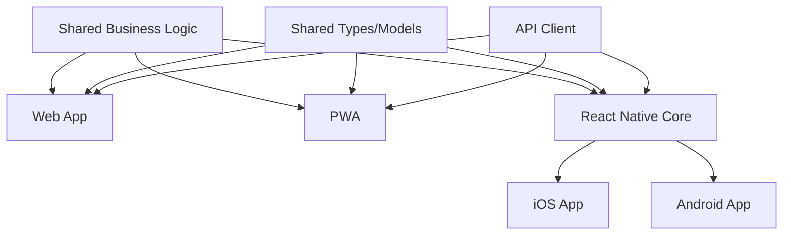

# Mobile Feature Parity Matrix - Rishi Platform

## Overview

This document provides a comprehensive comparison of features across Web, PWA, iOS Native, and Android Native platforms, ensuring consistent user experience and strategic feature deployment across all platforms.

## Feature Parity Strategy

### Core Principles
1. **Essential Features First**: Core functionality available on all platforms
2. **Progressive Enhancement**: Advanced features on capable platforms
3. **Platform Optimization**: Leverage platform-specific capabilities
4. **Consistent UX**: Unified experience across platforms
5. **Strategic Differentiation**: Platform-specific advantages

## Feature Comparison Matrix

### Authentication & Security

| Feature | Web | PWA | iOS | Android | Notes |
|---------|-----|-----|-----|---------|-------|
| Email/Password Login | ✅ | ✅ | ✅ | ✅ | Core feature |
| JWT Token Management | ✅ | ✅ | ✅ | ✅ | Secure storage varies |
| Organization Switching | ✅ | ✅ | ✅ | ✅ | Context preservation |
| Session Management | ✅ | ✅ | ✅ | ✅ | Platform-specific timeout |
| Biometric Authentication | ❌ | ⚠️ | ✅ | ✅ | WebAuthn for PWA |
| Multi-Factor Auth | ✅ | ✅ | ✅ | ✅ | SMS/TOTP support |
| SSO Integration | ✅ | ✅ | ✅ | ✅ | OAuth2/SAML |
| Offline Authentication | ❌ | ✅ | ✅ | ✅ | Cached credentials |

### Core Workforce Management

| Feature | Web | PWA | iOS | Android | Notes |
|---------|-----|-----|-----|---------|-------|
| View Schedule | ✅ | ✅ | ✅ | ✅ | Real-time updates |
| Clock In/Out | ✅ | ✅ | ✅ | ✅ | GPS validation |
| Availability Management | ✅ | ✅ | ✅ | ✅ | Calendar integration |
| Shift Swapping | ✅ | ✅ | ✅ | ✅ | Approval workflow |
| Time Off Requests | ✅ | ✅ | ✅ | ✅ | Manager approval |
| Break Tracking | ✅ | ✅ | ✅ | ✅ | Compliance tracking |
| Overtime Alerts | ✅ | ✅ | ✅ | ✅ | Push notifications |
| Expense Submission | ✅ | ✅ | ✅ | ✅ | Receipt capture |

### Booking Management

| Feature | Web | PWA | iOS | Android | Notes |
|---------|-----|-----|-----|---------|-------|
| Create Booking | ✅ | ⚠️ | ✅ | ✅ | Complex forms |
| Edit Booking | ✅ | ✅ | ✅ | ✅ | Version control |
| View Bookings | ✅ | ✅ | ✅ | ✅ | List and calendar |
| Recurring Bookings | ✅ | ⚠️ | ✅ | ✅ | Advanced scheduling |
| Staff Assignment | ✅ | ✅ | ✅ | ✅ | Drag-and-drop varies |
| Budget Tracking | ✅ | ✅ | ✅ | ✅ | Real-time updates |
| Location Selection | ✅ | ✅ | ✅ | ✅ | Maps integration |
| Activity Management | ✅ | ✅ | ✅ | ✅ | Multi-activity support |

### Communication Features

| Feature | Web | PWA | iOS | Android | Notes |
|---------|-----|-----|-----|---------|-------|
| In-App Messaging | ✅ | ✅ | ✅ | ✅ | Real-time sync |
| Push Notifications | ❌ | ✅ | ✅ | ✅ | Platform-specific |
| Email Notifications | ✅ | ✅ | ✅ | ✅ | User preferences |
| SMS Notifications | ✅ | ✅ | ✅ | ✅ | Opt-in required |
| Team Chat | ✅ | ✅ | ✅ | ✅ | Group messaging |
| Announcements | ✅ | ✅ | ✅ | ✅ | Broadcast messages |
| Video Calling | ✅ | ⚠️ | ✅ | ✅ | WebRTC support |
| File Sharing | ✅ | ✅ | ✅ | ✅ | Size limits vary |

### Location Services

| Feature | Web | PWA | iOS | Android | Notes |
|---------|-----|-----|-----|---------|-------|
| GPS Check-in | ⚠️ | ✅ | ✅ | ✅ | Browser limitations |
| Geofencing | ❌ | ⚠️ | ✅ | ✅ | Background location |
| Route Planning | ✅ | ✅ | ✅ | ✅ | Maps integration |
| Location History | ✅ | ✅ | ✅ | ✅ | Privacy controls |
| Offline Maps | ❌ | ⚠️ | ✅ | ✅ | Download capability |
| Real-time Tracking | ⚠️ | ⚠️ | ✅ | ✅ | Battery optimization |
| Site Check-in | ✅ | ✅ | ✅ | ✅ | QR/NFC options |

### Offline Capabilities

| Feature | Web | PWA | iOS | Android | Notes |
|---------|-----|-----|-----|---------|-------|
| View Schedule | ❌ | ✅ | ✅ | ✅ | Cached data |
| Clock In/Out | ❌ | ✅ | ✅ | ✅ | Queue for sync |
| View Assignments | ❌ | ✅ | ✅ | ✅ | Local storage |
| Submit Reports | ❌ | ✅ | ✅ | ✅ | Background sync |
| Access Documents | ❌ | ✅ | ✅ | ✅ | Selective download |
| Message Drafts | ✅ | ✅ | ✅ | ✅ | Local save |
| Photo Capture | ❌ | ✅ | ✅ | ✅ | Queue upload |
| Expense Tracking | ❌ | ✅ | ✅ | ✅ | Offline creation |

### Reporting & Analytics

| Feature | Web | PWA | iOS | Android | Notes |
|---------|-----|-----|-----|---------|-------|
| Dashboard Views | ✅ | ✅ | ✅ | ✅ | Responsive design |
| Custom Reports | ✅ | ⚠️ | ⚠️ | ⚠️ | Complex on mobile |
| Export Functions | ✅ | ✅ | ✅ | ✅ | Format options |
| Real-time Analytics | ✅ | ✅ | ✅ | ✅ | Live updates |
| Historical Data | ✅ | ✅ | ✅ | ✅ | Date ranges |
| Visualizations | ✅ | ✅ | ✅ | ✅ | Chart libraries |
| Scheduled Reports | ✅ | ✅ | ✅ | ✅ | Email delivery |
| Drill-down Analysis | ✅ | ⚠️ | ⚠️ | ⚠️ | Touch limitations |

### Admin Features

| Feature | Web | PWA | iOS | Android | Notes |
|---------|-----|-----|-----|---------|-------|
| User Management | ✅ | ⚠️ | ⚠️ | ⚠️ | Complex forms |
| Role Assignment | ✅ | ✅ | ✅ | ✅ | Simplified mobile |
| Organization Settings | ✅ | ⚠️ | ⚠️ | ⚠️ | Limited mobile |
| Bulk Operations | ✅ | ❌ | ❌ | ❌ | Desktop only |
| System Configuration | ✅ | ❌ | ❌ | ❌ | Web exclusive |
| Audit Logs | ✅ | ✅ | ⚠️ | ⚠️ | Read-only mobile |
| Integration Setup | ✅ | ❌ | ❌ | ❌ | Technical complexity |
| Billing Management | ✅ | ⚠️ | ⚠️ | ⚠️ | View-only mobile |

### Platform-Specific Features

#### PWA Unique Features
```typescript
const pwaFeatures = {
  installPrompt: "Add to home screen",
  offlineFirst: "Service worker caching",
  pushNotifications: "Web push API",
  backgroundSync: "Queue operations",
  shareTarget: "Receive shared content",
  shortcuts: "Quick action tiles"
};
```

#### iOS Unique Features
```typescript
const iosFeatures = {
  widgets: "Home screen widgets",
  siriShortcuts: "Voice commands",
  appleWatch: "Companion app",
  faceId: "Biometric auth",
  handoff: "Cross-device continuity",
  spotlight: "Deep search integration"
};
```

#### Android Unique Features
```typescript
const androidFeatures = {
  widgets: "Home screen widgets",
  googleAssistant: "Voice integration",
  wearOS: "Smartwatch app",
  fingerprint: "Biometric auth",
  splitScreen: "Multi-window support",
  quickSettings: "Status bar tiles"
};
```

## Implementation Priority

### Phase 1: Core Feature Parity (Months 1-2)
**Must Have on All Platforms**
1. Authentication & basic security
2. Schedule viewing and management
3. Clock in/out functionality
4. Basic communication
5. Essential offline features

### Phase 2: Enhanced Features (Months 3-4)
**Progressive Enhancement**
1. Advanced scheduling features
2. Full messaging capabilities
3. Location services
4. Reporting dashboards
5. Push notifications

### Phase 3: Platform Optimization (Months 5-6)
**Leverage Native Capabilities**
1. Biometric authentication
2. Platform widgets
3. Voice integration
4. Wearable support
5. Advanced offline features

## Feature Development Guidelines

### Mobile-First Features
```typescript
// Features designed primarily for mobile
const mobileFirstFeatures = [
  "Quick clock in/out",
  "GPS check-in",
  "Photo documentation",
  "Voice notes",
  "Gesture navigation",
  "One-handed operation"
];
```

### Desktop-First Features
```typescript
// Features requiring desktop capabilities
const desktopFirstFeatures = [
  "Complex report builders",
  "Bulk data operations",
  "Multi-window workflows",
  "Advanced configurations",
  "Integration management",
  "System administration"
];
```

## Cross-Platform Development Strategy

### Shared Code Architecture


### Code Sharing Strategy
```typescript
// Shared modules across platforms
export const sharedModules = {
  models: "TypeScript interfaces and types",
  validation: "Zod schemas for all platforms",
  api: "Unified API client",
  utils: "Common utility functions",
  constants: "Shared configuration",
  businessLogic: "Core algorithms"
};
```

## Platform-Specific Considerations

### Web Platform
**Strengths**:
- Full feature set
- Large screen optimization
- Keyboard shortcuts
- Multi-tab workflows
- Complex interactions

**Limitations**:
- No offline capability
- Limited device access
- No push notifications
- Browser compatibility

### PWA Platform
**Strengths**:
- Offline capability
- Push notifications
- App-like experience
- Single codebase
- Auto-updates

**Limitations**:
- iOS restrictions
- Limited device APIs
- App store presence
- Background limitations

### Native Platforms
**Strengths**:
- Full device access
- Best performance
- Platform integration
- Offline first
- App store presence

**Limitations**:
- Separate codebases
- Update delays
- Development cost
- Maintenance overhead

## Testing Strategy

### Cross-Platform Testing Matrix
| Test Type | Web | PWA | iOS | Android |
|-----------|-----|-----|-----|---------|
| Unit Tests | ✅ | ✅ | ✅ | ✅ |
| Integration Tests | ✅ | ✅ | ✅ | ✅ |
| E2E Tests | ✅ | ✅ | ✅ | ✅ |
| Performance Tests | ✅ | ✅ | ✅ | ✅ |
| Offline Tests | ❌ | ✅ | ✅ | ✅ |
| Device-Specific | ❌ | ⚠️ | ✅ | ✅ |

## Success Metrics

### Platform Adoption Targets
- Web: 40% of total users
- PWA: 30% of total users
- iOS: 20% of total users
- Android: 10% of total users

### Feature Usage Targets
- Core features: 95% adoption
- Advanced features: 60% adoption
- Platform-specific: 40% adoption

### Performance Targets
- App launch: <2 seconds
- Screen transitions: <300ms
- Offline sync: <5 seconds
- Battery impact: <5% per hour

## Conclusion

This feature parity matrix ensures consistent user experience across all platforms while leveraging platform-specific capabilities. The phased approach allows for rapid deployment of core features while progressively enhancing the experience based on platform capabilities. Regular review and updates of this matrix ensure alignment with user needs and technology evolution.