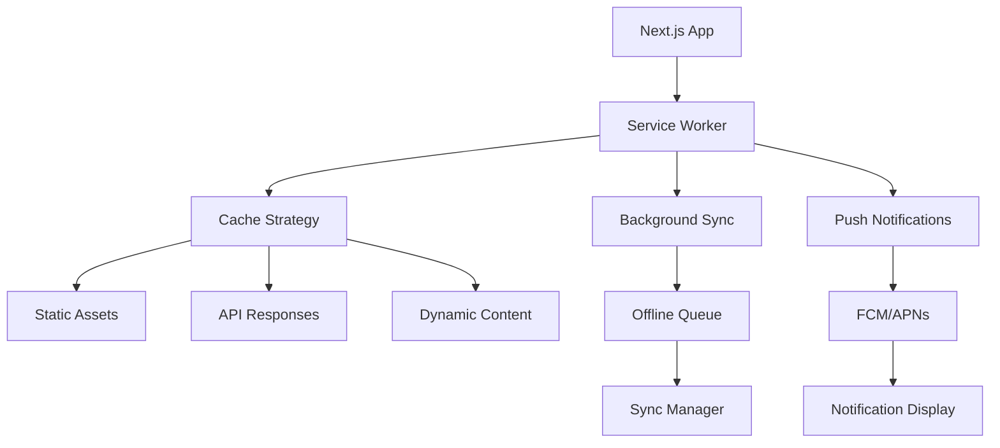

# Progressive Web App Development Plan - Rishi Platform

## Executive Summary

This document outlines the comprehensive plan for developing a Progressive Web App (PWA) for the Rishi Platform, enabling mobile access with native-like functionality while maintaining a single codebase. The PWA will provide offline capabilities, push notifications, and app store distribution.

## PWA Objectives

### Primary Goals
1. **Native-like Experience**: Deliver app-like performance and feel
2. **Offline Functionality**: Enable work without connectivity
3. **Cross-platform**: Single app for iOS and Android
4. **App Store Presence**: Distribute through app stores
5. **Reduced Development Cost**: Maintain single codebase

### Target Metrics
- App launch time: <2 seconds
- Offline capability: 100% core features
- App size: <10MB initial download
- Performance score: 95+ (Lighthouse)
- User engagement: 3x vs mobile web

## Technical Architecture

### PWA Technology Stack

```javascript
// Core Technologies
- Next.js 15.3.2 (existing)
- Workbox 7.0 (service worker)
- IndexedDB (offline storage)
- Web Push API (notifications)
- Capacitor (app store packaging)

// Additional Libraries
- PWA Install Prompt
- Background Sync API
- Cache API
- Web Share API
- Vibration API
```

### Architecture Overview



## Development Phases

### Phase 1: PWA Foundation (Weeks 1-2)

#### 1.1 Service Worker Implementation
```javascript
// service-worker.js
import { precacheAndRoute } from 'workbox-precaching';
import { registerRoute } from 'workbox-routing';
import { StaleWhileRevalidate, NetworkFirst } from 'workbox-strategies';
import { ExpirationPlugin } from 'workbox-expiration';
import { BackgroundSyncPlugin } from 'workbox-background-sync';

// Precache all static assets
precacheAndRoute(self.__WB_MANIFEST);

// API caching strategy
registerRoute(
  ({ url }) => url.pathname.startsWith('/api/'),
  new NetworkFirst({
    cacheName: 'api-cache',
    plugins: [
      new ExpirationPlugin({
        maxEntries: 100,
        maxAgeSeconds: 5 * 60 // 5 minutes
      }),
      new BackgroundSyncPlugin('api-queue', {
        maxRetentionTime: 24 * 60 // 24 hours
      })
    ]
  })
);

// Image caching
registerRoute(
  ({ request }) => request.destination === 'image',
  new StaleWhileRevalidate({
    cacheName: 'images-cache',
    plugins: [
      new ExpirationPlugin({
        maxEntries: 60,
        maxAgeSeconds: 30 * 24 * 60 * 60 // 30 days
      })
    ]
  })
);
```

#### 1.2 Web App Manifest
```json
{
  "name": "Rishi Platform - Cannabis Workforce Management",
  "short_name": "Rishi",
  "description": "Comprehensive workforce management for cannabis operations",
  "theme_color": "#10b981",
  "background_color": "#ffffff",
  "display": "standalone",
  "orientation": "portrait",
  "scope": "/",
  "start_url": "/?source=pwa",
  "icons": [
    {
      "src": "/icons/icon-72x72.png",
      "sizes": "72x72",
      "type": "image/png"
    },
    {
      "src": "/icons/icon-96x96.png",
      "sizes": "96x96",
      "type": "image/png"
    },
    {
      "src": "/icons/icon-128x128.png",
      "sizes": "128x128",
      "type": "image/png"
    },
    {
      "src": "/icons/icon-144x144.png",
      "sizes": "144x144",
      "type": "image/png"
    },
    {
      "src": "/icons/icon-152x152.png",
      "sizes": "152x152",
      "type": "image/png"
    },
    {
      "src": "/icons/icon-192x192.png",
      "sizes": "192x192",
      "type": "image/png",
      "purpose": "maskable"
    },
    {
      "src": "/icons/icon-384x384.png",
      "sizes": "384x384",
      "type": "image/png"
    },
    {
      "src": "/icons/icon-512x512.png",
      "sizes": "512x512",
      "type": "image/png"
    }
  ],
  "screenshots": [
    {
      "src": "/screenshots/dashboard.png",
      "type": "image/png",
      "sizes": "1080x1920"
    },
    {
      "src": "/screenshots/bookings.png",
      "type": "image/png",
      "sizes": "1080x1920"
    }
  ],
  "shortcuts": [
    {
      "name": "New Booking",
      "url": "/bookings/new",
      "icons": [{ "src": "/icons/new-booking.png", "sizes": "96x96" }]
    },
    {
      "name": "My Schedule",
      "url": "/schedule",
      "icons": [{ "src": "/icons/schedule.png", "sizes": "96x96" }]
    }
  ]
}
```

### Phase 2: Offline Capabilities (Weeks 3-4)

#### 2.1 Offline Storage Strategy
```typescript
// offline-storage.ts
import { openDB, DBSchema } from 'idb';

interface RishiDB extends DBSchema {
  bookings: {
    key: string;
    value: Booking;
    indexes: { 'by-date': Date; 'by-status': string };
  };
  users: {
    key: string;
    value: User;
    indexes: { 'by-organization': string };
  };
  sync-queue: {
    key: number;
    value: SyncItem;
  };
}

export class OfflineStorage {
  private db: IDBDatabase;

  async initialize() {
    this.db = await openDB<RishiDB>('rishi-platform', 1, {
      upgrade(db) {
        // Bookings store
        const bookingStore = db.createObjectStore('bookings', {
          keyPath: 'id'
        });
        bookingStore.createIndex('by-date', 'startDate');
        bookingStore.createIndex('by-status', 'status');

        // Users store
        const userStore = db.createObjectStore('users', {
          keyPath: 'id'
        });
        userStore.createIndex('by-organization', 'organizationId');

        // Sync queue
        db.createObjectStore('sync-queue', {
          keyPath: 'id',
          autoIncrement: true
        });
      }
    });
  }

  async saveBooking(booking: Booking) {
    const tx = this.db.transaction('bookings', 'readwrite');
    await tx.store.put(booking);
    await tx.done;
  }

  async getBookings(filter?: BookingFilter) {
    const tx = this.db.transaction('bookings', 'readonly');
    let bookings: Booking[];
    
    if (filter?.date) {
      const index = tx.store.index('by-date');
      bookings = await index.getAll(filter.date);
    } else {
      bookings = await tx.store.getAll();
    }
    
    return bookings;
  }

  async addToSyncQueue(item: SyncItem) {
    const tx = this.db.transaction('sync-queue', 'readwrite');
    await tx.store.add(item);
    await tx.done;
  }
}
```

#### 2.2 Sync Strategy
```typescript
// sync-manager.ts
export class SyncManager {
  private queue: SyncQueue;
  
  async sync() {
    const items = await this.queue.getAll();
    
    for (const item of items) {
      try {
        await this.processItem(item);
        await this.queue.remove(item.id);
      } catch (error) {
        console.error('Sync failed for item:', item, error);
        await this.queue.updateRetryCount(item.id);
      }
    }
  }

  private async processItem(item: SyncItem) {
    switch (item.type) {
      case 'CREATE_BOOKING':
        return await api.createBooking(item.data);
      case 'UPDATE_BOOKING':
        return await api.updateBooking(item.id, item.data);
      case 'DELETE_BOOKING':
        return await api.deleteBooking(item.id);
      default:
        throw new Error(`Unknown sync type: ${item.type}`);
    }
  }
}
```

### Phase 3: Push Notifications (Weeks 5-6)

#### 3.1 Push Notification Setup
```typescript
// push-notifications.ts
export class PushNotificationService {
  private registration: ServiceWorkerRegistration;

  async initialize() {
    // Check if notifications are supported
    if (!('Notification' in window)) {
      throw new Error('Notifications not supported');
    }

    // Request permission
    const permission = await Notification.requestPermission();
    if (permission !== 'granted') {
      throw new Error('Notification permission denied');
    }

    // Get service worker registration
    this.registration = await navigator.serviceWorker.ready;

    // Subscribe to push notifications
    const subscription = await this.registration.pushManager.subscribe({
      userVisibleOnly: true,
      applicationServerKey: this.urlB64ToUint8Array(PUBLIC_VAPID_KEY)
    });

    // Send subscription to server
    await this.sendSubscriptionToServer(subscription);
  }

  async sendNotification(notification: NotificationPayload) {
    await this.registration.showNotification(notification.title, {
      body: notification.body,
      icon: '/icons/icon-192x192.png',
      badge: '/icons/badge-72x72.png',
      vibrate: [200, 100, 200],
      tag: notification.tag,
      requireInteraction: notification.priority === 'high',
      actions: notification.actions,
      data: notification.data
    });
  }
}
```

#### 3.2 Notification Categories
```typescript
// notification-types.ts
export const NotificationTypes = {
  BOOKING_ASSIGNED: {
    title: 'New Booking Assignment',
    icon: '📅',
    actions: [
      { action: 'view', title: 'View Details' },
      { action: 'accept', title: 'Accept' }
    ]
  },
  SHIFT_REMINDER: {
    title: 'Shift Starting Soon',
    icon: '⏰',
    actions: [
      { action: 'view', title: 'View Details' },
      { action: 'navigate', title: 'Get Directions' }
    ]
  },
  MESSAGE_RECEIVED: {
    title: 'New Message',
    icon: '💬',
    actions: [
      { action: 'reply', title: 'Reply' },
      { action: 'view', title: 'View' }
    ]
  }
};
```

### Phase 4: Mobile Optimizations (Weeks 7-8)

#### 4.1 Touch Gestures
```typescript
// touch-gestures.ts
import { useSwipeable } from 'react-swipeable';

export function useAppGestures() {
  const handlers = useSwipeable({
    onSwipedLeft: () => navigateNext(),
    onSwipedRight: () => navigateBack(),
    onSwipedDown: () => refreshData(),
    preventDefaultTouchmoveEvent: true,
    trackMouse: true
  });

  return handlers;
}

// Haptic feedback
export function hapticFeedback(type: 'light' | 'medium' | 'heavy') {
  if ('vibrate' in navigator) {
    const patterns = {
      light: [10],
      medium: [30],
      heavy: [50, 30, 50]
    };
    navigator.vibrate(patterns[type]);
  }
}
```

#### 4.2 Performance Optimizations
```typescript
// performance-optimizations.ts

// Virtual scrolling for large lists
import { VirtualList } from '@tanstack/react-virtual';

// Image optimization
export function OptimizedImage({ src, alt, ...props }) {
  return (
    
  );
}

// Reduce motion for accessibility
export function useReducedMotion() {
  const [reducedMotion, setReducedMotion] = useState(false);

  useEffect(() => {
    const mediaQuery = window.matchMedia('(prefers-reduced-motion: reduce)');
    setReducedMotion(mediaQuery.matches);

    const listener = (e) => setReducedMotion(e.matches);
    mediaQuery.addEventListener('change', listener);
    return () => mediaQuery.removeEventListener('change', listener);
  }, []);

  return reducedMotion;
}
```

## App Store Distribution

### Phase 5: Store Packaging (Weeks 9-10)

#### 5.1 Capacitor Configuration
```javascript
// capacitor.config.ts
import { CapacitorConfig } from '@capacitor/cli';

const config: CapacitorConfig = {
  appId: 'com.rishiplatform.app',
  appName: 'Rishi Platform',
  webDir: 'out',
  bundledWebRuntime: false,
  server: {
    url: 'https://app.rishiplatform.com',
    cleartext: false
  },
  plugins: {
    PushNotifications: {
      presentationOptions: ['badge', 'sound', 'alert']
    },
    LocalNotifications: {
      smallIcon: 'ic_stat_icon',
      iconColor: '#10b981'
    }
  }
};

export default config;
```

#### 5.2 Store Listings
```markdown
## App Store (iOS) Listing

**Title**: Rishi Platform - Cannabis Workforce
**Subtitle**: Manage your cannabis workforce efficiently
**Keywords**: cannabis, workforce, management, scheduling, staffing

**Description**:
Rishi Platform is the comprehensive workforce management solution designed specifically for the cannabis industry. Manage staff, schedule events, track performance, and ensure compliance with ease.

Features:
• Schedule and manage cannabis events
• Track staff availability and assignments
• Real-time communication and updates
• Compliance documentation and tracking
• Performance analytics and reporting
• Offline access to critical information

## Google Play Listing

**Title**: Rishi Platform - Cannabis Workforce Management
**Short Description**: Professional workforce management for cannabis operations

**Full Description**:
[Similar to App Store description with formatting adjustments]
```

## PWA Features Implementation

### Core Features

#### 1. Install Prompt
```typescript
// install-prompt.tsx
export function InstallPrompt() {
  const [deferredPrompt, setDeferredPrompt] = useState(null);
  const [showPrompt, setShowPrompt] = useState(false);

  useEffect(() => {
    const handler = (e) => {
      e.preventDefault();
      setDeferredPrompt(e);
      setShowPrompt(true);
    };

    window.addEventListener('beforeinstallprompt', handler);
    return () => window.removeEventListener('beforeinstallprompt', handler);
  }, []);

  const handleInstall = async () => {
    if (!deferredPrompt) return;
    
    deferredPrompt.prompt();
    const { outcome } = await deferredPrompt.userChoice;
    
    if (outcome === 'accepted') {
      analytics.track('PWA Installed');
    }
    
    setDeferredPrompt(null);
    setShowPrompt(false);
  };

  if (!showPrompt) return null;

  return (
    <div className="install-prompt">
      <p>Install Rishi Platform for a better experience</p>
      <button onClick={handleInstall}>Install</button>
      <button onClick={() => setShowPrompt(false)}>Not now</button>
    </div>
  );
}
```

#### 2. Update Prompt
```typescript
// update-prompt.tsx
export function UpdatePrompt() {
  const [updateAvailable, setUpdateAvailable] = useState(false);

  useEffect(() => {
    if ('serviceWorker' in navigator) {
      navigator.serviceWorker.addEventListener('controllerchange', () => {
        setUpdateAvailable(true);
      });
    }
  }, []);

  const handleUpdate = () => {
    window.location.reload();
  };

  if (!updateAvailable) return null;

  return (
    <div className="update-prompt">
      <p>A new version is available!</p>
      <button onClick={handleUpdate}>Update Now</button>
    </div>
  );
}
```

## Testing Strategy

### PWA Testing Checklist

#### Functionality Testing
- [ ] Service worker registration
- [ ] Offline page loading
- [ ] Data sync when online
- [ ] Push notification delivery
- [ ] Install prompt appearance
- [ ] App-like navigation

#### Performance Testing
- [ ] Lighthouse PWA audit (>95)
- [ ] Time to interactive (<3s)
- [ ] First contentful paint (<1.5s)
- [ ] Cache efficiency
- [ ] Offline performance

#### Cross-Device Testing
- [ ] iOS Safari
- [ ] Android Chrome
- [ ] iPad
- [ ] Various screen sizes
- [ ] Different network conditions

## Monitoring & Analytics

### PWA Metrics
```typescript
// pwa-analytics.ts
export class PWAAnalytics {
  trackInstall() {
    analytics.track('PWA Install', {
      source: this.getInstallSource(),
      device: this.getDeviceInfo()
    });
  }

  trackEngagement() {
    analytics.track('PWA Engagement', {
      sessionLength: this.getSessionLength(),
      offlineUsage: this.getOfflineUsage(),
      notificationInteraction: this.getNotificationMetrics()
    });
  }

  trackPerformance() {
    if ('PerformanceObserver' in window) {
      const observer = new PerformanceObserver((list) => {
        for (const entry of list.getEntries()) {
          analytics.track('PWA Performance', {
            name: entry.name,
            duration: entry.duration,
            startTime: entry.startTime
          });
        }
      });
      observer.observe({ entryTypes: ['navigation', 'resource'] });
    }
  }
}
```

## Launch Strategy

### Soft Launch (Week 11)
- Internal team testing
- 10 pilot clients
- Feedback collection
- Bug fixes

### Public Launch (Week 12)
- App store submission
- Marketing campaign
- User onboarding
- Support preparation

## Success Metrics

### Technical Metrics
- Lighthouse score: >95
- Install conversion: >30%
- Offline usage: >50%
- Push opt-in: >60%
- Crash rate: <0.1%

### Business Metrics
- User engagement: +40%
- Session duration: +60%
- Feature adoption: +50%
- User retention: +30%
- Support tickets: -20%

## Conclusion

This PWA development plan provides a comprehensive approach to bringing the Rishi Platform to mobile users through a Progressive Web App. By leveraging modern web capabilities, we can deliver a native-like experience while maintaining a single codebase, reducing development costs, and accelerating time to market. The phased approach ensures systematic implementation with continuous testing and optimization.