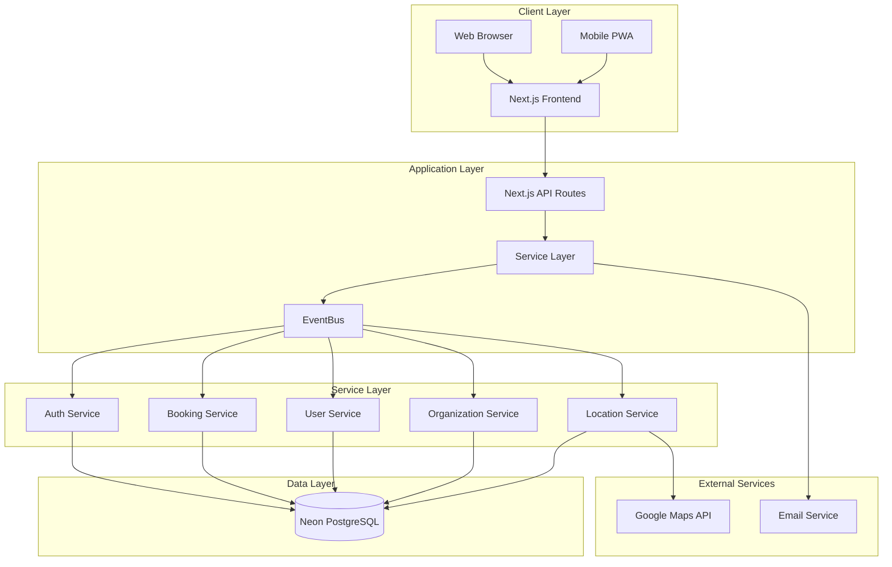
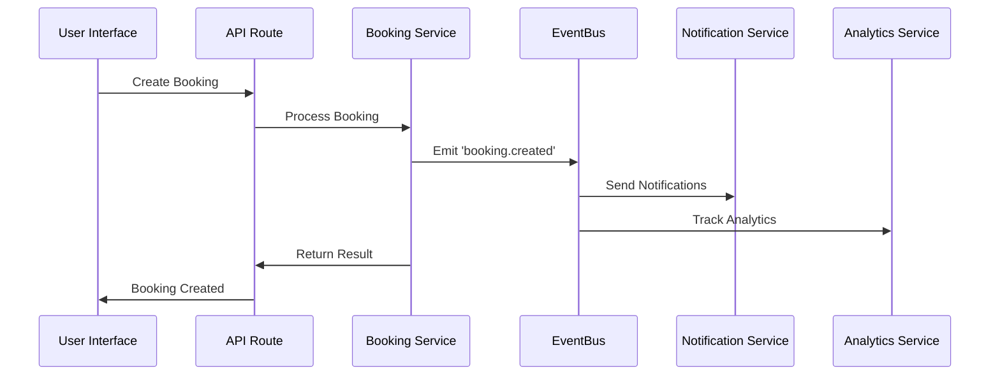

# Current Architecture - Rishi Platform

## System Architecture Overview

The Rishi Platform is built on a modern, microservices-oriented architecture within a Next.js monolithic application structure. This hybrid approach provides the benefits of service separation while maintaining deployment simplicity.



## Technology Stack Details

### Frontend Architecture

#### Core Technologies
```javascript
{
  "framework": "Next.js 15.3.2",
  "language": "TypeScript 5.x",
  "ui": {
    "components": "Shadcn/ui (Radix UI)",
    "styling": "Tailwind CSS 3.x",
    "icons": "Lucide React",
    "animations": "Framer Motion"
  },
  "state": {
    "global": "React Context API",
    "server": "TanStack Query v5",
    "forms": "React Hook Form + Zod"
  }
}
```

#### Component Architecture
```typescript
// Component hierarchy
src/
├── app/                    # Next.js app directory
│   ├── (auth)/            # Auth group routes
│   ├── (dashboard)/       # Dashboard routes
│   ├── api/               # API routes
│   └── components/        # Shared components
├── components/            # UI components
│   ├── ui/               # Base UI components
│   ├── bookings/         # Booking components
│   ├── auth/             # Auth components
│   └── shared/           # Shared components
└── lib/                   # Utilities and helpers
```

### Backend Architecture

#### API Structure
```typescript
// API route pattern
app/api/
├── auth/                  # Authentication endpoints
├── bookings/             # Booking management
├── organizations/        # Organization management
├── users/                # User management
├── locations/            # Location services
└── admin/                # Admin functions
```

#### Service Layer Pattern
```typescript
// Service implementation pattern
export class BookingService {
  private eventBus: EventBus;
  private repository: BookingRepository;

  async createBooking(data: CreateBookingDTO): Promise<Booking> {
    // Validate input
    const validated = bookingSchema.parse(data);
    
    // Business logic
    const booking = await this.repository.create(validated);
    
    // Emit event
    await this.eventBus.emit('booking.created', booking);
    
    return booking;
  }
}
```

### Database Architecture

#### Schema Design
```sql
-- Multi-tenant structure
Organizations (id, name, tier, settings)
├── Users (id, organizationId, role, profile)
├── Bookings (id, organizationId, status, details)
├── Locations (id, organizationId, address, coordinates)
└── AuditLogs (id, organizationId, action, timestamp)

-- Relationships
Users >--< Organizations (many-to-many via user_organizations)
Bookings >--- Organizations (many-to-one)
Bookings >--- Locations (many-to-one)
Bookings >--< Users (many-to-many via assignments)
```

#### Data Access Layer
```typescript
// Drizzle ORM implementation
import { db } from '@/lib/db';
import { bookings, users, organizations } from '@/schema';

export class BookingRepository {
  async findByOrganization(orgId: string) {
    return await db
      .select()
      .from(bookings)
      .where(eq(bookings.organizationId, orgId))
      .leftJoin(users, eq(bookings.assignedTo, users.id))
      .leftJoin(locations, eq(bookings.locationId, locations.id));
  }
}
```

### Event-Driven Architecture

#### EventBus Implementation
```typescript
// Centralized event system
export class EventBus {
  private handlers: Map<string, EventHandler[]> = new Map();

  on(event: string, handler: EventHandler) {
    const handlers = this.handlers.get(event) || [];
    handlers.push(handler);
    this.handlers.set(event, handlers);
  }

  async emit(event: string, data: any) {
    const handlers = this.handlers.get(event) || [];
    
    // Log event for audit trail
    await this.logEvent(event, data);
    
    // Execute handlers asynchronously
    await Promise.all(
      handlers.map(handler => handler(data))
    );
  }
}
```

#### Event Flow Example


### Authentication & Authorization

#### JWT Token Structure
```typescript
interface JWTPayload {
  userId: string;
  email: string;
  role: UserRole;
  organizationId: string;
  organizationRole: OrganizationRole;
  permissions: Permission[];
  exp: number;
  iat: number;
}
```

#### RBAC Implementation
```typescript
// Permission checking
export function hasPermission(
  user: User,
  resource: string,
  action: string
): boolean {
  // Super admin has all permissions
  if (user.role === 'super_admin') return true;
  
  // Check role-based permissions
  const rolePermissions = ROLE_PERMISSIONS[user.role];
  return rolePermissions.some(p => 
    p.resource === resource && 
    p.actions.includes(action)
  );
}
```

### Integration Architecture

#### External Service Integration
```typescript
// Google Maps integration
export class LocationService {
  private mapsClient: GoogleMapsClient;
  
  async geocodeAddress(address: string): Promise<Coordinates> {
    const result = await this.mapsClient.geocode({ address });
    return {
      lat: result.geometry.location.lat,
      lng: result.geometry.location.lng
    };
  }
}
```

#### API Integration Pattern
```typescript
// Standardized API client
export class APIClient {
  private baseURL: string;
  private headers: Headers;

  async request<T>(
    method: string,
    endpoint: string,
    data?: any
  ): Promise<T> {
    const response = await fetch(`${this.baseURL}${endpoint}`, {
      method,
      headers: this.headers,
      body: JSON.stringify(data)
    });

    if (!response.ok) {
      throw new APIError(response.status, await response.text());
    }

    return response.json();
  }
}
```

## Current Infrastructure

### Development Environment
- **Platform**: Replit
- **Hot Reload**: Enabled
- **Database**: Neon PostgreSQL (development instance)
- **Environment**: Isolated development containers

### Staging Environment
- **Platform**: Replit Autoscale
- **Scaling**: 2-10 instances
- **Database**: Neon PostgreSQL (staging instance)
- **Features**: Load testing, integration testing

### Production Environment (Planned)
- **Platform**: Vercel
- **CDN**: Global edge network
- **Database**: Neon PostgreSQL (production instance)
- **Monitoring**: Vercel Analytics + custom metrics

## Performance Characteristics

### Current Metrics
```yaml
Build Performance:
  - Module count: 1299+
  - Build time: ~10-15 seconds
  - Hot reload: <2 seconds

Runtime Performance:
  - API response: 200-500ms average
  - Page load: 2-4 seconds
  - Database queries: 50-200ms

Scalability:
  - Concurrent users: 100-500 (current)
  - Database connections: 20 (pooled)
  - Memory usage: 512MB-1GB
```

### Bottlenecks Identified
1. **Database Connection Pooling**: Limited connections
2. **API Response Times**: Some endpoints >500ms
3. **Bundle Size**: Initial load could be optimized
4. **Real-time Features**: WebSocket scaling needed

## Security Architecture

### Current Security Measures
```typescript
// Security implementations
{
  authentication: {
    type: "JWT",
    expiration: "24h",
    refresh: "7d",
    storage: "httpOnly cookies"
  },
  
  authorization: {
    type: "RBAC",
    levels: 6,
    contextual: true,
    inheritance: false
  },
  
  encryption: {
    transit: "HTTPS/TLS 1.3",
    rest: "AES-256",
    passwords: "bcrypt",
    tokens: "HS256"
  },
  
  validation: {
    input: "Zod schemas",
    sql: "Parameterized queries",
    xss: "React escaping",
    csrf: "Token validation"
  }
}
```

### Security Gaps
- No multi-factor authentication
- Limited rate limiting
- Basic audit logging
- No intrusion detection
- Manual security updates

## Monitoring & Observability

### Current Monitoring
```javascript
// Basic monitoring setup
{
  logging: {
    framework: "Console/Winston",
    levels: ["error", "warn", "info", "debug"],
    storage: "Local files"
  },
  
  errors: {
    tracking: "Console logs",
    alerts: "Manual checking",
    recovery: "Service restart"
  },
  
  performance: {
    metrics: "Basic timing",
    tracking: "Manual",
    optimization: "Reactive"
  }
}
```

### Observability Gaps
- No distributed tracing
- Limited metrics collection
- No centralized logging
- Basic error tracking
- Manual performance monitoring

## Development Workflow

### Current CI/CD Pipeline
```yaml
Development:
  - Local development in Replit
  - Manual testing
  - Direct push to repository

Staging:
  - Manual deployment to Replit Autoscale
  - Basic smoke testing
  - Manual promotion

Production:
  - Not yet implemented
  - Planned Vercel deployment
  - Automated testing needed
```

### Development Tools
- TypeScript for type safety
- ESLint for code quality
- Prettier for formatting
- Jest for unit testing (limited)
- Manual integration testing

## Architecture Strengths

1. **Modern Stack**: Latest Next.js with TypeScript
2. **Service Separation**: Clear service boundaries
3. **Event-Driven**: Scalable communication pattern
4. **Type Safety**: End-to-end TypeScript
5. **Component Reuse**: Well-organized components

## Architecture Weaknesses

1. **Monolithic Deployment**: All services in one app
2. **Limited Testing**: Minimal automated tests
3. **Basic Monitoring**: Insufficient observability
4. **Database Coupling**: Direct ORM usage
5. **Security Gaps**: Missing advanced features

## Improvement Opportunities

### Short-term (0-3 months)
1. Implement comprehensive testing
2. Add monitoring and alerting
3. Enhance security features
4. Optimize performance
5. Improve documentation

### Medium-term (3-6 months)
1. Extract microservices
2. Implement caching layer
3. Add message queue
4. Enhance real-time features
5. Build CI/CD pipeline

### Long-term (6-12 months)
1. Full microservices architecture
2. Container orchestration
3. Advanced analytics
4. Machine learning integration
5. Global scaling strategy

## Conclusion

The current architecture provides a solid foundation for the Rishi Platform with modern technologies and good architectural patterns. The event-driven design and service separation prepare the system for future scaling. Key areas for improvement include testing, monitoring, security enhancements, and gradual evolution toward true microservices architecture. The platform is well-positioned for growth with targeted architectural improvements.